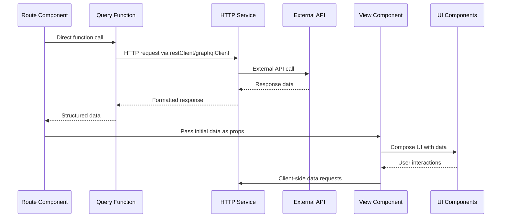
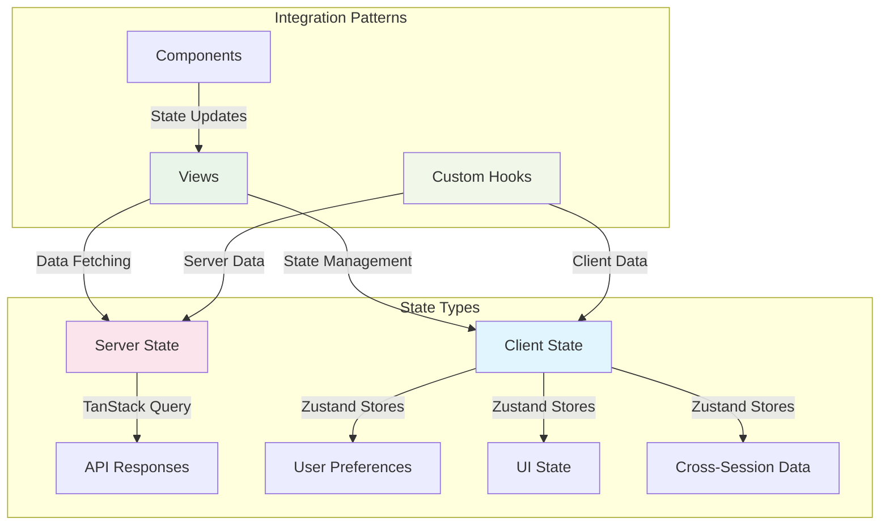
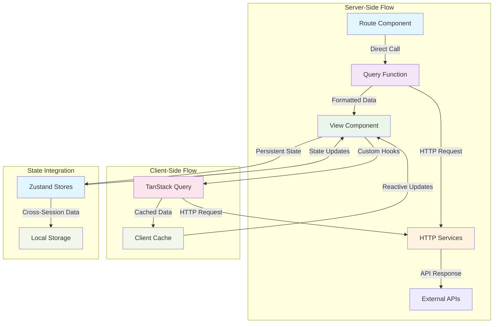
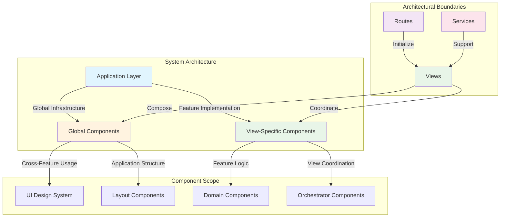
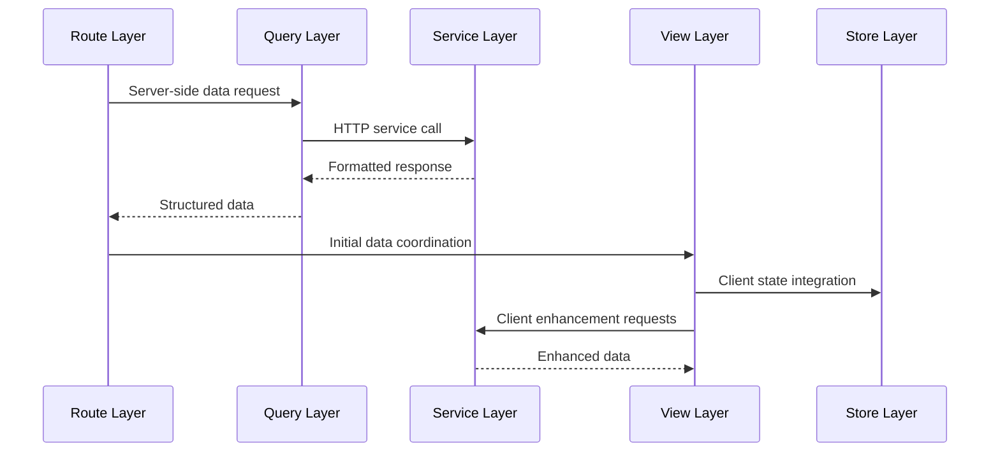

# Architecture

Application architecture patterns and design principles for scalable development.

## Table of Contents

- [Overview](#overview)
- [Architecture Patterns](#architecture-patterns)
- [Layer Implementation](#layer-implementation)
- [Data Flow Strategy](#data-flow-strategy)
- [Component Organization](#component-organization)
- [Implementation Guidelines](#implementation-guidelines)

---

## Overview

The template uses a **coordinator pattern** with Views as central orchestrators, providing clear separation of concerns while maintaining development productivity. The architecture prioritizes maintainability through established conventions and explicit data flow patterns.

**Live Implementation:** Pokemon Detail at `/pokemons/pikachu` demonstrates every architectural pattern described below, serving as a comprehensive reference for teams implementing new features.

**Core Architectural Principle:**
Views act as coordinators that orchestrate data fetching, state management, component composition, and user interactions, while maintaining clear boundaries between server-side and client-side concerns.

---

## Architecture Patterns

### Layered Architecture Model

The application follows a layered architecture with clear separation of responsibilities and explicit data flow patterns:

## Application Architecture Layers

### Server-Side Layer

- **Routes** → Server Data → **Queries** → HTTP Requests → **Services** → API Responses → **External APIs**

### Client-Side Layer

- **Views** → Client Data → **Hooks** → HTTP Requests → **Services**
- **Views** → Component Composition → **Components**
- **Views** → State Management → **Stores**
- **Views** → Helper Functions → **Utils**

### Data Flow Integration

- **Initial Data**: Queries → Views
- **Unified API**: Services ↔ Queries & Hooks
- **User Interactions**: Components → Views
- **Persistent State**: Stores ↔ Views
- **Pure Functions**: Utils → Components & Views

**Architecture Flow Overview:**

The coordinator pattern ensures that Views serve as the central orchestration point for all page functionality, while maintaining clear boundaries between different concerns and rendering contexts.

### Route-View Relationship Pattern

**Core Principle:**
Every page route has a corresponding view component, with routes handling server-side setup and views coordinating all page functionality.

**Implementation Reference:** [`app/(routes)/(public)/(examples)/pokemons/[pokemon]/page.tsx`](<../app/(routes)/(public)/(examples)/pokemons/[pokemon]/page.tsx>)

**Route Responsibilities:**

- Server component implementation for initial data fetching
- Metadata generation for SEO optimization
- Static generation configuration when applicable
- Error handling at the route level
- Data validation and error boundaries

**View Responsibilities:**

- Complete page implementation and user experience
- Component composition and layout orchestration
- Client-side state management and user interactions
- Integration between server data and client enhancements
- Progressive enhancement without blocking initial render

**Data Flow Pattern:**



---

## Layer Implementation

### Routes Layer - Server-Side Entry Points

**Core Responsibility:**
Server components that handle routing, initial data fetching, and server-side rendering optimization.

**Key Characteristics:**

- Server component implementation with async data fetching
- Next.js App Router integration with file-based routing
- Metadata generation for SEO and social sharing
- Static generation and ISR configuration
- Route-level error handling and not-found scenarios

**Implementation Pattern:**

```typescript
// Route structure example
const PagePokemon = async ({ params }: IPagePokemonProps) => {
  const { pokemon } = await params
  const pokemonData = await getPokemonDetailData(pokemon)

  if (!pokemonData.success || !pokemonData.data) {
    notFound()
  }

  return <ViewPokemon data={pokemonData.data} />
}
```

**Reference Implementation:** [`app/(routes)/(public)/(examples)/pokemons/[pokemon]/page.tsx`](<../app/(routes)/(public)/(examples)/pokemons/[pokemon]/page.tsx>)

**Key Features:**

- Automatic static generation with `generateStaticParams`
- Dynamic metadata generation with `generateMetadata`
- ISR configuration with `revalidate` directive
- Error handling with graceful fallbacks
- Direct query function integration

---

### Queries Layer - Data Fetching Abstraction

**Core Responsibility:**
Co-located data fetching functions that handle API communication, error handling, and response formatting.

**Architectural Decision:**
Queries are co-located with routes to maintain proximity between data requirements and route implementation, while providing reusable data fetching patterns.

**Key Characteristics:**

- Type-safe API response handling with comprehensive error boundaries
- Integration with HTTP services for consistent API patterns
- Response formatting and validation
- Cache configuration and revalidation strategies
- Error handling with structured response objects

**Implementation Pattern:**

```typescript
// Query structure example
const getPokemonDetailData = async (name: string) => {
  try {
    const response = await restClient.get<IPokemonDetail>(
      `/pokemon/${name.toLowerCase()}`,
      {
        baseUrl: 'https://pokeapi.co/api/v2',
        revalidate: 3600,
      },
    )

    return {
      success: true,
      data: response,
      error: null,
    }
  } catch (error) {
    return {
      success: false,
      data: null,
      error: error instanceof Error ? error.message : 'Unknown error',
    }
  }
}
```

**Reference Implementation:** [`app/(routes)/(public)/(examples)/pokemons/[pokemon]/queries/get-pokemon-detail.query.ts`](<../app/(routes)/(public)/(examples)/pokemons/[pokemon]/queries/get-pokemon-detail.query.ts>)

**Benefits:**

- Consistent error handling patterns across all data fetching
- Type safety with TypeScript integration
- Reusable data fetching logic
- Integration with Next.js caching mechanisms
- Clear separation between data fetching and presentation

---

### Views Layer - Central Orchestrators

**Core Responsibility:**
Complete page implementations that orchestrate data, state, components, and user interactions as central coordination points.

**Architectural Decision:**
Views serve as the primary coordination layer, integrating server data from routes with client-side enhancements, state management, and component composition.

**Key Characteristics:**

- Complete page structure and user experience implementation
- Integration between server data and client-side enhancements
- State management coordination across multiple sources
- Component composition with clear data flow
- User interaction handling and progressive enhancement

**Implementation Pattern:**

```typescript
// View structure example
const ViewPokemon = ({ data: pokemon }: IViewPokemonProps) => {
  const { addToHistory } = usePokemonHistoryStore()

  useEffect(() => {
    const pokemonForHistory = {
      name: pokemon.name,
      url: `https://pokeapi.co/api/v2/pokemon/${pokemon.name}`,
      image: pokemon.sprites.front_default || '',
    }
    addToHistory(pokemonForHistory)
  }, [pokemon.name, pokemon.sprites.front_default, addToHistory])

  return (
    <div className='min-h-screen bg-gradient-to-br from-gray-50 to-gray-100 py-6'>
      {/* Component composition with server data */}
      <PokemonSpeciesInfo pokemonId={pokemon.id} />
      <PokemonMoves pokemonName={pokemon.name} />
    </div>
  )
}
```

**Reference Implementation:** [`app/views/pokemon/pokemon.tsx`](../app/views/pokemon/pokemon.tsx)

**Coordination Capabilities:**

- **Server Data Integration**: Receives initial data from route as props
- **Client State Management**: Integrates with Zustand stores for persistent state
- **Component Composition**: Orchestrates both global and view-specific components
- **Progressive Enhancement**: Adds client-side features without blocking initial render
- **User Experience**: Handles loading states, error boundaries, and user interactions

---

### Services Layer - Unified API Communication

**Core Responsibility:**
Unified HTTP clients and API communication patterns used by both server-side queries and client-side hooks.

**Architectural Decision:**
Services provide a unified abstraction layer for API communication, supporting both REST and GraphQL patterns with consistent error handling and type safety.

**Key Characteristics:**

- Universal HTTP clients supporting both server and client contexts
- REST and GraphQL adapter implementations
- Consistent error handling and response formatting
- Type-safe request/response patterns
- Cache integration with Next.js and TanStack Query

**Implementation Overview:**

```typescript
// Services expose unified clients
export { restClient } from './rest'
export { graphqlClient } from './graphql'
export type { IRestRequestOptions, IGraphQLRequest } from './types'
```

**Reference Implementation:** [`app/services/http/`](../app/services/http/)

**Usage Contexts:**

- **Server-side**: Used by query functions for initial data fetching
- **Client-side**: Used by custom hooks for dynamic data updates
- **Universal**: Same API patterns work in both rendering contexts
- **Flexible**: Teams can choose REST or GraphQL based on data requirements

---

### Stores Layer - Client State Management

**Core Responsibility:**
Client-side state management for user preferences, UI state, and cross-session data persistence.

**State Management Strategy:**



**Implementation Pattern:**

```typescript
// Store structure example
const usePokemonHistoryStore = create<IPokemonHistoryStore>()(
  persist(
    (set) => ({
      history: [],
      addToHistory: (pokemon: IPokemon) => {
        return set((state) => {
          // State mutation logic with persistence
        })
      },
      clearHistory: () => set({ history: [] }),
    }),
    {
      name: 'pokemon-history',
      partialize: (state) => ({ history: state.history }),
    },
  ),
)
```

**Reference Implementation:** [`app/stores/pokemon-history/`](../app/stores/pokemon-history/)

**Store Characteristics:**

- **Feature-based**: Stores organized by feature domains
- **Persistent**: Cross-session data with local storage integration
- **Type-safe**: Full TypeScript integration with interfaces
- **Reactive**: Automatic component updates on state changes

---

## Data Flow Strategy

### Unified Data Architecture

**Core Philosophy:**
Seamless integration between server-side and client-side data patterns, with services providing unified API communication for both contexts.

**Data Flow Patterns:**



**Integration Benefits:**

- **Unified API Patterns**: Same HTTP services work for both server and client
- **Consistent Error Handling**: Standardized error patterns across all data fetching
- **Type Safety**: Full TypeScript integration throughout the data flow
- **Performance Optimization**: Appropriate caching strategies for each context
- **Developer Experience**: Consistent patterns reduce cognitive load

### Implementation Strategy

**Server-Side Data Pattern:**

- Routes call query functions directly for initial data fetching
- Query functions use HTTP services with Next.js caching integration
- Data passed to views as props for immediate rendering
- ISR configuration for optimal performance and SEO

**Client-Side Enhancement Pattern:**

- Views use custom hooks for dynamic data requirements
- Custom hooks integrate TanStack Query for reactive caching
- Same HTTP services provide consistent API patterns
- Progressive enhancement without blocking initial render

**Hybrid Implementation Example:**

The Pokemon Detail page demonstrates this pattern:

1. **Server-side**: Route fetches initial Pokemon data via REST service
2. **Client-side**: View enhances with moves data via GraphQL service
3. **State management**: Zustand store handles viewing history persistence
4. **User experience**: Fast initial render with progressive feature enhancement

---

## Component Organization

### Architectural Component Hierarchy

**System-Level Component Strategy:**
Components are organized by architectural scope and responsibility within the overall system design, promoting reusability and maintaining clear boundaries between different system layers.

**Component Architecture Levels:**



**Architectural Scope Boundaries:**

- **Global Infrastructure**: Components serving application-wide architectural needs
- **Feature Domain**: Components encapsulating specific business domain logic
- **View Orchestration**: Components coordinating between different architectural layers
- **System Integration**: Components bridging external systems and internal architecture

**Architectural Benefits:**

- **Layer Separation**: Clear boundaries between different system responsibilities
- **Scalability**: Components can evolve independently within their architectural scope
- **Maintainability**: Architectural patterns provide predictable structure for teams
- **Reusability**: Components designed with architectural scope in mind promote appropriate reuse

---

## Implementation Guidelines

### Architectural Implementation Patterns

**Coordinator Pattern Implementation:**

The architecture enforces a clear coordinator pattern where Views serve as orchestration points between different system layers:

```typescript
// Architectural pattern example
const ViewPokemon = ({ data }: IViewProps) => {
  // Layer Integration: State management
  const { addToHistory } = usePokemonHistoryStore()

  // Layer Integration: Client-side enhancement
  const { data: enhancedData } = usePokemonMoves()

  // Layer Integration: Component orchestration
  return (
    <div>
      <ServerDataComponent data={data} />
      <ClientDataComponent enhanced={enhancedData} />
    </div>
  )
}
```

**Architectural Coordination Principles:**

- **Single Coordination Point**: Views coordinate all page-level system interactions
- **Layer Integration**: Views bridge server-side and client-side architectural layers
- **State Orchestration**: Views manage integration between different state management systems
- **Progressive Architecture**: Views enable progressive enhancement without architectural complexity

### System Layer Integration

**Multi-Layer Data Architecture:**

The system integrates multiple architectural layers seamlessly through established patterns:



**Integration Guidelines:**

- **Server-Client Bridge**: Views serve as architectural bridge between server and client layers
- **Service Abstraction**: Unified service layer provides consistent API patterns across contexts
- **State Coordination**: Views orchestrate between server state (TanStack Query) and client state (Zustand)
- **Progressive Layers**: Each layer can enhance functionality without breaking architectural boundaries

### Architectural Decision Framework

**Technology Selection Within Architecture:**

The architecture provides flexibility for teams to make technology choices within established patterns:

**Service Layer Decisions:**

- **REST or GraphQL**: Both adapters work within the same architectural patterns
- **Caching Strategy**: TanStack Query for client, Next.js ISR for server
- **State Management**: Zustand for client state, service layer for server state

**Component Architecture Decisions:**

- **Global vs Domain**: Components classified by architectural scope, not just reusability
- **Orchestration Level**: Views determine component coordination patterns
- **Enhancement Strategy**: Progressive enhancement through architectural layers

**Implementation Flexibility:**

- **Framework Agnostic**: Architectural patterns independent of specific implementations
- **Team Autonomy**: Teams choose specific technologies within architectural boundaries
- **Evolution Path**: Architecture supports incremental adoption and changes
