# Architecture

Application architecture patterns and design principles for scalable development.

## Table of Contents

- [Overview](#overview)
- [Architecture Patterns](#architecture-patterns)
- [Layer Implementation](#layer-implementation)
- [Data Flow Strategy](#data-flow-strategy)
- [Component Organization](#component-organization)
- [Implementation Guidelines](#implementation-guidelines)

## Related Documentation

- [Code Organization](./code-organization.md) - Project structure and module organization patterns
- [Data Fetching](./data-fetching.md) - Service layer implementation and API integration
- [Caching](./caching.md) - Performance optimization and cache coordination
- [State Management](./state-management.md) - Coordinator pattern and state architecture
- [Examples](./examples.md) - Practical implementation samples of architectural patterns

---

## Overview

The template uses a **coordinator pattern** with Views as central orchestrators, providing clear separation of concerns while maintaining development productivity. The architecture prioritizes maintainability through established conventions and explicit data flow patterns.

#### Core Architectural Principle

Views act as coordinators that orchestrate data fetching, state management, component composition, and user interactions, while maintaining clear boundaries between server-side and client-side concerns.

---

## Architecture Patterns

### Layered Architecture Model

The application follows a layered architecture with clear separation of responsibilities and explicit data flow patterns:

### Application Architecture Layers

```mermaid
graph TB
subgraph "🖥️ Server-Side Layer"
Routes["🛣️ Routes<br/>(Server Components)"]
Queries["📊 Queries<br/>(Data Fetching)"]
ServerServices["🔧 Services<br/>(HTTP Layer)"]
APIs["🌐 External APIs"]

        Routes --> Queries
        Queries --> ServerServices
        ServerServices --> APIs
    end

    subgraph "💻 Client-Side Layer"
        Views["Views<br/>(Central Coordinator)"]
        Hooks["Hooks<br/>(Client Data)"]
        Components["Components<br/>(UI Elements)"]
        Stores["Stores<br/>(State Management)"]
        Utils["Utils<br/>(Helper Functions)"]
        ClientServices["🔧 Services<br/>(HTTP Layer)"]

        Views --> Hooks
        Views --> Components
        Views --> Stores
        Views --> Utils
        Hooks --> ClientServices
    end

    subgraph "Data Flow Integration"
        DataFlow1["Initial Data"]
        DataFlow2["Unified API"]
        DataFlow3["User Interactions"]
        DataFlow4["Persistent State"]
        DataFlow5["Pure Functions"]
    end

    Queries -.->|"Initial Data"| Views
    ServerServices <-.->|"Unified API"| ClientServices
    Components -.->|"User Interactions"| Views
    Stores <-.->|"Persistent State"| Views
    Utils -.->|"Pure Functions"| Components
    Utils -.->|"Pure Functions"| Views

    classDef serverLayer fill:#e1f5fe,stroke:#01579b,stroke-width:2px
    classDef clientLayer fill:#e8f5e8,stroke:#2e7d32,stroke-width:2px
    classDef dataFlow fill:#fff3e0,stroke:#ef6c00,stroke-width:2px
    classDef coordinator fill:#f3e5f5,stroke:#7b1fa2,stroke-width:3px

    class Routes,Queries,ServerServices,APIs serverLayer
    class Views,Hooks,Components,Stores,Utils,ClientServices clientLayer
    class DataFlow1,DataFlow2,DataFlow3,DataFlow4,DataFlow5 dataFlow
    class Views coordinator
```



#### Architecture Flow Overview

The coordinator pattern ensures that Views serve as the central orchestration point for all page functionality, while maintaining clear boundaries between different concerns and rendering contexts.

### Route-View Relationship Pattern

#### Core Principle

Every page route has a corresponding view component, with routes handling server-side setup and views coordinating all page functionality.

#### Route Responsibilities

- Server component implementation for initial data fetching
- Metadata generation for SEO optimization
- Static generation configuration when applicable
- Error handling at the route level
- Data validation and error boundaries

#### View Responsibilities

- Complete page implementation and user experience
- Component composition and layout orchestration
- Client-side state management and user interactions
- Integration between server data and client enhancements
- Progressive enhancement without blocking initial render

#### Data Flow Pattern


---

## Layer Implementation

### Routes Layer - Server-Side Entry Points

#### Core Responsibility

Server components that handle routing, initial data fetching, and server-side rendering optimization.

#### Key Characteristics

- Server component implementation with async data fetching
- Next.js App Router integration with file-based routing
- Metadata generation for SEO and social sharing
- Static generation and ISR configuration
- Route-level error handling and not-found scenarios

#### Implementation Pattern

```typescript
// Route structure example
const Page = async ({ params }: IPageProps) => {
  const { id } = await params
  const data = await getEntityData(id)

  if (!data.success || !data.data) {
    notFound()
  }

  return <View data={data.data} />
}
```

#### Key Features

- Automatic static generation with [`generateStaticParams`](https://nextjs.org/docs/app/api-reference/functions/generate-static-params)
- Dynamic metadata generation with [`generateMetadata`](https://nextjs.org/docs/app/api-reference/functions/generate-metadata)
- ISR configuration with [`revalidate`](https://nextjs.org/docs/app/building-your-application/data-fetching/fetching-caching-and-revalidating#revalidating-data) directive
- Error handling with graceful fallbacks
- Direct query function integration

---

### Queries Layer - Data Fetching Abstraction

#### Core Responsibility

Co-located data fetching functions that handle API communication, error handling, and response formatting.

#### Architectural Decision

Queries are co-located with routes to maintain proximity between data requirements and route implementation, while providing reusable data fetching patterns.

#### Key Characteristics

- Type-safe API response handling with comprehensive error boundaries
- Integration with `@/services/http` for consistent API patterns
- Response formatting and validation
- Cache configuration and revalidation strategies
- Error handling with structured response objects

#### Implementation Pattern

```typescript
// Query structure example
const getEntityData = async (id: string) => {
  try {
    const response = await restClient.get<IEntity>(`/entities/${id}`, {
      baseUrl: process.env.API_BASE_URL,
      revalidate: 3600,
    })

    return {
      success: true,
      data: response,
      error: null,
    }
  } catch (error) {
    return {
      success: false,
      data: null,
      error: error instanceof Error ? error.message : 'Unknown error',
    }
  }
}
```

#### Benefits

- Consistent error handling patterns across all data fetching
- Type safety with TypeScript integration
- Reusable data fetching logic
- Integration with [Next.js caching mechanisms](https://nextjs.org/docs/app/building-your-application/caching)
- Clear separation between data fetching and presentation

---

### Views Layer - Central Orchestrators

#### Core Responsibility

Complete page implementations that orchestrate data, state, components, and user interactions as central coordination points.

#### Architectural Decision

Views serve as the primary coordination layer, integrating server data from routes with client-side enhancements, state management, and component composition.

#### Key Characteristics

- Complete page structure and user experience implementation
- Integration between server data and client-side enhancements
- State management coordination across multiple sources
- Component composition with clear data flow
- User interaction handling and progressive enhancement

#### Implementation Pattern

```typescript
// View structure example
const View = ({ data }: IViewProps) => {
  const { addToHistory } = useHistoryStore()

  useEffect(() => {
    const item = {
      id: data.id,
      name: data.name,
      timestamp: Date.now(),
    }
    addToHistory(item)
  }, [data.id, data.name, addToHistory])

  return (
    <div className='min-h-screen bg-gradient-to-br from-gray-50 to-gray-100 py-6'>
      {/* Component composition with server data */}
      <EntityDetails entity={data} />
      <RelatedItems entityId={data.id} />
    </div>
  )
}
```

#### Coordination Capabilities

- **Server Data Integration**: Receives initial data from route as props
- **Client State Management**: Integrates with [Zustand stores](https://zustand-demo.pmnd.rs/) for persistent state
- **Component Composition**: Orchestrates both global and view-specific components
- **Progressive Enhancement**: Adds client-side features without blocking initial render
- **User Experience**: Handles loading states, error boundaries, and user interactions

---

### Services Layer - Unified API Communication

#### Core Responsibility

Unified HTTP clients and API communication patterns used by both server-side queries and client-side hooks.

#### Architectural Decision

Services provide a unified abstraction layer for API communication, supporting both REST and GraphQL patterns with consistent error handling and type safety.

#### Key Characteristics

- Universal HTTP clients supporting both server and client contexts
- REST and GraphQL adapter implementations
- Consistent error handling and response formatting
- Type-safe request/response patterns
- Cache integration with Next.js and TanStack Query

#### Implementation Overview

```typescript
// Services expose unified clients
export { restClient } from './rest'
export { graphqlClient } from './graphql'
export type { IRestRequestOptions, IGraphQLRequest } from './types'
```

#### Reference Implementation

`@/services/http`

#### Usage Contexts

- **Server-side**: Used by query functions for initial data fetching
- **Client-side**: Used by custom hooks for dynamic data updates
- **Universal**: Same API patterns work in both rendering contexts
- **Flexible**: Teams can choose REST or GraphQL based on data requirements

---

### Stores Layer - Client State Management

#### Core Responsibility

Client-side state management for user preferences, UI state, and cross-session data persistence.

#### State Management Strategy


#### Implementation Pattern

```typescript
// Store structure example
const useHistoryStore = create<IHistoryStore>()(
  persist(
    (set) => ({
      history: [],
      addToHistory: (item: IHistoryItem) => {
        return set((state) => {
          // State mutation logic with persistence
          const updatedHistory = [item, ...state.history.slice(0, 9)]
          return { history: updatedHistory }
        })
      },
      clearHistory: () => set({ history: [] }),
    }),
    {
      name: 'app-history',
      partialize: (state) => ({ history: state.history }),
    },
  ),
)
```

#### Store Characteristics

- **Feature-based**: Stores organized by feature domains
- **Persistent**: Cross-session data with [local storage integration](https://github.com/pmndrs/zustand#persist-middleware)
- **Type-safe**: Full TypeScript integration with interfaces
- **Reactive**: Automatic component updates on state changes

---

## Data Flow Strategy

### Overview

This section outlines the data flow patterns that enable seamless integration between server-side and client-side operations, ensuring optimal performance and developer experience across all architectural layers.

#### Data Flow Patterns


#### Integration Benefits

- **Unified API Patterns**: Same HTTP services work for both server and client
- **Consistent Error Handling**: Standardized error patterns across all data fetching
- **Type Safety**: Full TypeScript integration throughout the data flow
- **Performance Optimization**: Appropriate caching strategies for each context
- **Developer Experience**: Consistent patterns reduce cognitive load

### Implementation Strategy

#### Server-Side Data Pattern

- Routes call query functions directly for initial data fetching
- Query functions use `@/services/http` with [Next.js caching integration](https://nextjs.org/docs/app/building-your-application/caching)
- Data passed to views as props for immediate rendering
- ISR configuration for optimal performance and SEO

#### Client-Side Enhancement Pattern

- Views use custom hooks for dynamic data requirements
- Custom hooks integrate [TanStack Query](https://tanstack.com/query/latest) for reactive caching
- Same `@/services/http` provide consistent API patterns
- Progressive enhancement without blocking initial render

#### Hybrid Implementation Example

A typical detail page demonstrates this pattern:

1. **Server-side**: Route fetches initial entity data via REST service
2. **Client-side**: View enhances with related data via GraphQL service
3. **State management**: Zustand store handles viewing history persistence
4. **User experience**: Fast initial render with progressive feature enhancement

---

## Component Organization

### Architectural Component Hierarchy

#### System-Level Component Strategy

Components are organized by architectural scope and responsibility within the overall system design, promoting reusability and maintaining clear boundaries between different system layers.

#### Component Architecture Levels


#### Architectural Scope Boundaries

- **Global Infrastructure**: Components serving application-wide architectural needs
- **Feature Domain**: Components encapsulating specific business domain logic
- **View Orchestration**: Components coordinating between different architectural layers
- **System Integration**: Components bridging external systems and internal architecture

#### Architectural Benefits

- **Layer Separation**: Clear boundaries between different system responsibilities
- **Scalability**: Components can evolve independently within their architectural scope
- **Maintainability**: Architectural patterns provide predictable structure for teams
- **Reusability**: Components designed with architectural scope in mind promote appropriate reuse

---

## Implementation Guidelines

### Architectural Implementation Patterns

#### Coordinator Pattern Implementation

The architecture enforces a clear coordinator pattern where Views serve as orchestration points between different system layers:

```typescript
// Architectural pattern example
const View = ({ data }: IViewProps) => {
  // Layer Integration: State management
  const { addToHistory } = useHistoryStore()

  // Layer Integration: Client-side enhancement
  const { data: enhancedData } = useEnhancedData()

  // Layer Integration: Component orchestration
  return (
    <div>
      <ServerDataComponent data={data} />
      <ClientDataComponent enhanced={enhancedData} />
    </div>
  )
}
```

#### Architectural Coordination Principles

- **Single Coordination Point**: Views coordinate all page-level system interactions
- **Layer Integration**: Views bridge server-side and client-side architectural layers
- **State Orchestration**: Views manage integration between different state management systems
- **Progressive Architecture**: Views enable progressive enhancement without architectural complexity

### System Layer Integration

#### Multi-Layer Data Architecture

The system integrates multiple architectural layers seamlessly through established patterns:


#### Integration Guidelines

- **Server-Client Bridge**: Views serve as architectural bridge between server and client layers
- **Service Abstraction**: Unified `@/services/http` provides consistent API patterns across contexts
- **State Coordination**: Views orchestrate between server state ([TanStack Query](https://tanstack.com/query/latest)) and client state ([Zustand](https://zustand-demo.pmnd.rs/))
- **Progressive Layers**: Each layer can enhance functionality without breaking architectural boundaries

### Architectural Decision Framework

#### Technology Selection Within Architecture

The architecture provides flexibility for teams to make technology choices within established patterns:

##### Service Layer Decisions

- **REST or GraphQL**: Both adapters work within the same architectural patterns using `@/services/http`
- **Caching Strategy**: [TanStack Query](https://tanstack.com/query/latest/docs/framework/react/overview) for client, [Next.js ISR](https://nextjs.org/docs/app/building-your-application/data-fetching/fetching-caching-and-revalidating) for server
- **State Management**: [Zustand](https://zustand-demo.pmnd.rs/) for client state, service layer for server state

##### Component Architecture Decisions

- **Global vs Domain**: Components classified by architectural scope, not just reusability
- **Orchestration Level**: Views determine component coordination patterns
- **Enhancement Strategy**: Progressive enhancement through architectural layers

##### Implementation Flexibility

- **Framework Agnostic**: Architectural patterns independent of specific implementations
- **Team Autonomy**: Teams choose specific technologies within architectural boundaries
- **Evolution Path**: Architecture supports incremental adoption and changes

---

## References

| Documentation                                                                                                                                | Description                                                      |
| -------------------------------------------------------------------------------------------------------------------------------------------- | ---------------------------------------------------------------- |
| [App Router Caching](https://nextjs.org/docs/app/building-your-application/caching)                                                          | Comprehensive guide to Next.js caching strategies and mechanisms |
| [generateStaticParams](https://nextjs.org/docs/app/api-reference/functions/generate-static-params)                                           | API reference for static route generation at build time          |
| [generateMetadata](https://nextjs.org/docs/app/api-reference/functions/generate-metadata)                                                    | Dynamic metadata generation for SEO and social sharing           |
| [Data Revalidation](https://nextjs.org/docs/app/building-your-application/data-fetching/fetching-caching-and-revalidating#revalidating-data) | ISR configuration and data revalidation strategies               |
| [React Overview](https://tanstack.com/query/latest/docs/framework/react/overview)                                                            | Complete React integration guide for client-side caching         |
| [Main Documentation](https://tanstack.com/query/latest)                                                                                      | Core concepts and API reference for reactive data fetching       |
| [Demo & Documentation](https://zustand-demo.pmnd.rs/)                                                                                        | Interactive demos and complete state management guide            |
| [Persist Middleware](https://github.com/pmndrs/zustand#persist-middleware)                                                                   | Local storage integration for cross-session state persistence    |
