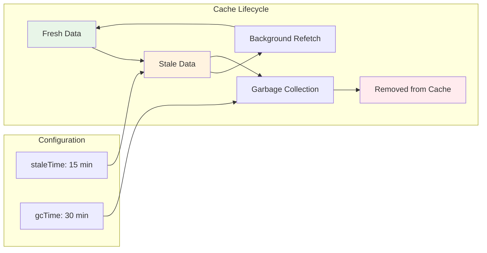
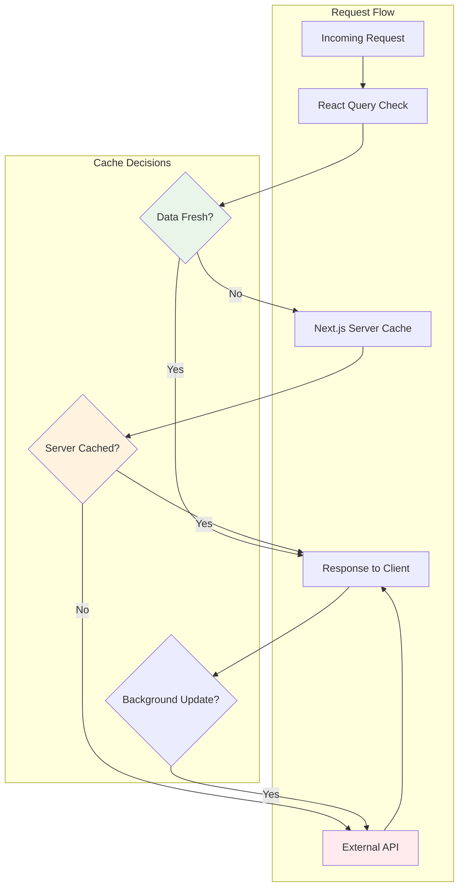

# Caching

Strategic caching implementation across client-side state management, server-side optimization, and browser-level performance to minimize redundant requests while maintaining data freshness.

## Table of Contents

- [Caching Architecture](#caching-architecture)
- [Client-Side Caching Strategy](#client-side-caching-strategy)
- [React Query Configuration](#react-query-configuration)
- [Cache Invalidation Patterns](#cache-invalidation-patterns)
- [Optimistic Updates](#optimistic-updates)
- [Performance Optimization](#performance-optimization)
- [Next.js Server Caching](#nextjs-server-caching)
- [Real-World Examples](#real-world-examples)
- [Testing Cache Behavior](#testing-cache-behavior)
- [Cache Management](#cache-management)

## Caching Architecture

The template implements a multi-layered caching strategy that coordinates between browser cache, React Query's in-memory cache, and Next.js server-side caching. This approach minimizes network requests while ensuring users see fresh data when it matters.

## Caching Layers (Top to Bottom)

| Layer                 | Purpose                     | Examples                 |
| --------------------- | --------------------------- | ------------------------ |
| **Browser Cache**     | Static assets, HTTP cache   | Images, CSS, JS files    |
| **React Query Cache** | In-memory server state      | API responses, user data |
| **Next.js Cache**     | Server-side data & requests | SSG, ISR, API responses  |
| **Network Cache**     | HTTP-level caching          | CDN, proxy cache         |

**Flow:** User Request → Browser Cache → React Query → Next.js Cache → Network/API

This architecture provides multiple cache layers that work together to optimize performance. The browser cache handles static assets, React Query manages client-side state, Next.js handles server-side data, and the network layer communicates with external APIs.

### Cache Layer Responsibilities

Each caching layer serves specific purposes within the overall strategy:

**Browser Cache**: Handles static assets like images, CSS, and JavaScript files. The template configures appropriate cache headers for different asset types through Next.js configuration.

**React Query Cache**: Manages server state in memory with intelligent staleness detection and background updates. This layer prevents redundant API calls and provides instant UI updates through cached data.

**Next.js Cache**: Provides server-side caching for API responses and static generation. Integrates with React Query through the fetch adapter to coordinate cache strategies.

**Network Cache**: Handles HTTP-level caching for external API responses at the network layer.

## Client-Side Caching Strategy

The template uses React Query to implement sophisticated client-side caching that adapts to different data patterns and user behaviors.

### Cache Configuration by Data Type

Different types of data require different caching strategies based on their update frequency and importance:

```typescript
// Long-lived reference data (from Pokemon species implementation)
const usePokemonSpecies = (pokemonId: number | undefined) => {
  return useQuery({
    queryKey: [POKEMON_SPECIES_QUERY_KEY, pokemonId],
    queryFn: () => fetchPokemonSpecies(pokemonId!),
    enabled: enabled && !!pokemonId,
    staleTime: 1000 * 60 * POKEMON_SPECIES_CONFIG.SPECIES_CACHE_MINUTES, // 30 minutes
    gcTime: 1000 * 60 * POKEMON_SPECIES_CONFIG.SPECIES_GC_MINUTES, // 60 minutes
    retry: POKEMON_SPECIES_CONFIG.RETRY_COUNT,
  })
}

// Moderate cache for dynamic content (from Pokemon moves implementation)
const usePokemonMovesGraphQL = (pokemonName: string) => {
  return useQuery({
    queryKey: [POKEMON_MOVES_GRAPHQL_QUERY_KEY, pokemonName],
    queryFn: () => fetchPokemonMovesGraphQL(pokemonName),
    staleTime:
      POKEMON_MOVES_GRAPHQL_CONFIG.POKEMON_MOVES_GRAPHQL_CACHE_MINUTES *
      60 *
      1000, // 15 minutes
    gcTime:
      POKEMON_MOVES_GRAPHQL_CONFIG.POKEMON_MOVES_GRAPHQL_GC_MINUTES * 60 * 1000, // 30 minutes
    retry: POKEMON_MOVES_GRAPHQL_CONFIG.RETRY_COUNT,
    enabled: options?.enabled,
  })
}

// Short cache for frequently changing data (from Pokemon list implementation)
export const useMorePokemons = ({ initialOffset = 8 } = {}) => {
  return useInfiniteQuery({
    queryKey: POKEMONS_QUERY_CONFIG.QUERY_KEY,
    queryFn: async ({ pageParam = initialOffset }) => {
      // Implementation details...
    },
    staleTime: POKEMONS_QUERY_CONFIG.STALE_TIME, // 5 minutes
    enabled: false, // Manual triggering for performance
  })
}
```

### Cache Configuration Constants

The template organizes cache settings through centralized configuration constants that teams can adjust based on their needs:

```typescript
// From app/views/pokemon/components/pokemon-species-info/pokemon-species.const.ts
export const POKEMON_SPECIES_CONFIG = {
  SPECIES_CACHE_MINUTES: 30, // Stale time: when data becomes stale
  SPECIES_GC_MINUTES: 60, // Garbage collection: when data is removed
  RETRY_COUNT: 2, // Number of retry attempts
}

// From app/views/pokemon/components/pokemon-moves/pokemon-moves.const.ts
export const POKEMON_MOVES_GRAPHQL_CONFIG = {
  POKEMON_MOVES_GRAPHQL_CACHE_MINUTES: 15, // Shorter cache for dynamic data
  POKEMON_MOVES_GRAPHQL_GC_MINUTES: 30,
  RETRY_COUNT: 2,
}

// From app/views/pokemons/pokemons.const.ts
export const POKEMONS_QUERY_CONFIG = {
  STALE_TIME: 5 * 60 * 1000, // 5 minutes for list data
  QUERY_KEY: ['pokemons', 'infinite'],
}
```

These configuration patterns allow teams to adjust caching behavior without modifying hook implementations.

## React Query Configuration

The template configures React Query with opinionated defaults that balance performance with development experience.

### Provider Configuration

The `HttpProvider` in `app/services/http/providers/react-query.tsx` establishes global caching behavior:

```typescript
export const HttpProvider = ({ children }: HttpProviderProps) => {
  const [queryClient] = useState(() => {
    return new QueryClient({
      defaultOptions: {
        queries: {
          staleTime: HTTP_CONFIG.DEFAULT_STALE_TIME, // 5 minutes
          retry: HTTP_CONFIG.DEFAULT_RETRY_COUNT,    // 1 retry (vs React Query's default of 3)
          refetchOnWindowFocus: false,               // Disabled (vs React Query's default of true)
          refetchOnReconnect: 'always',             // React Query's default
        },
        mutations: {
          retry: false,                             // Don't retry mutations automatically
        },
      },
    })
  })

  return (
    <QueryClientProvider client={queryClient}>{children}</QueryClientProvider>
  )
}
```

These defaults prioritize developer experience by reducing aggressive refetching while maintaining data freshness when reconnecting.

### Cache Lifecycle Management

React Query manages cache lifecycle through two key timing configurations:



**staleTime**: Determines how long data remains fresh. During this period, React Query serves cached data without network requests.

**gcTime** (formerly cacheTime): Controls how long stale data remains in memory. This allows instant loading when users return to previously viewed data.

## Cache Invalidation Patterns

The template implements strategic cache invalidation to maintain data consistency without excessive network activity.

### Mutation-Based Invalidation

Mutations automatically invalidate related cache entries to ensure UI consistency:

```typescript
const useUpdatePokemonData = () => {
  const queryClient = useQueryClient()

  return useMutation({
    mutationFn: updatePokemonInDatabase,
    onSuccess: (data, variables) => {
      // Invalidate specific Pokemon data
      queryClient.invalidateQueries({
        queryKey: [POKEMON_SPECIES_QUERY_KEY, variables.id],
      })

      // Invalidate Pokemon moves for the same Pokemon
      queryClient.invalidateQueries({
        queryKey: [POKEMON_MOVES_GRAPHQL_QUERY_KEY, variables.name],
      })

      // Invalidate list queries to reflect changes
      queryClient.invalidateQueries({
        queryKey: POKEMONS_QUERY_CONFIG.QUERY_KEY,
      })
    },
  })
}
```

### Selective Invalidation Strategies

Different scenarios require different invalidation approaches:

```typescript
// Exact match invalidation - only specific query
queryClient.invalidateQueries({
  queryKey: [POKEMON_SPECIES_QUERY_KEY, 25],
  exact: true,
})

// Prefix match invalidation - all Pokemon species queries
queryClient.invalidateQueries({
  queryKey: [POKEMON_SPECIES_QUERY_KEY],
})

// Predicate-based invalidation - complex logic
queryClient.invalidateQueries({
  predicate: (query) => {
    const [queryType, identifier] = query.queryKey
    return (
      queryType === 'pokemon-moves-graphql' &&
      identifier?.toString().startsWith('pika')
    )
  },
})
```

### Time-Based Invalidation

Automatic cache invalidation for time-sensitive data:

```typescript
const useAutoInvalidation = () => {
  const queryClient = useQueryClient()

  useEffect(() => {
    const interval = setInterval(() => {
      // Invalidate real-time data every 30 seconds
      queryClient.invalidateQueries({
        queryKey: ['real-time-pokemon-battles'],
        exact: true,
      })
    }, 30000)

    return () => clearInterval(interval)
  }, [queryClient])
}
```

## Optimistic Updates

The template supports optimistic updates that provide immediate feedback while maintaining data consistency.

### Optimistic Update Pattern

```typescript
const useOptimisticFavorite = () => {
  const queryClient = useQueryClient()

  return useMutation({
    mutationFn: updatePokemonFavorite,
    onMutate: async (variables) => {
      // Cancel any outgoing refetches for favorites
      await queryClient.cancelQueries({
        queryKey: ['pokemon-favorites'],
      })

      // Snapshot the previous value
      const previousFavorites = queryClient.getQueryData(['pokemon-favorites'])

      // Optimistically update the cache
      queryClient.setQueryData(['pokemon-favorites'], (old: IPokemon[]) => {
        if (variables.action === 'add') {
          return [...(old || []), variables.pokemon]
        } else {
          return old?.filter((p) => p.id !== variables.pokemon.id) || []
        }
      })

      // Return context with rollback data
      return { previousFavorites }
    },
    onError: (error, variables, context) => {
      // Rollback optimistic update on error
      if (context?.previousFavorites) {
        queryClient.setQueryData(
          ['pokemon-favorites'],
          context.previousFavorites,
        )
      }
    },
    onSettled: () => {
      // Always refetch to sync with server state
      queryClient.invalidateQueries({
        queryKey: ['pokemon-favorites'],
      })
    },
  })
}
```

### Optimistic UI Implementation

Components can provide immediate feedback using optimistic updates:

```typescript
const FavoriteButton: React.FC<{ pokemon: IPokemon }> = ({ pokemon }) => {
  const optimisticUpdate = useOptimisticFavorite()
  const { data: favorites } = useFavorites()

  const isFavorite = favorites?.some(f => f.id === pokemon.id) ?? false

  const handleToggle = () => {
    optimisticUpdate.mutate({
      pokemon,
      action: isFavorite ? 'remove' : 'add'
    })
  }

  return (
    <button
      onClick={handleToggle}
      disabled={optimisticUpdate.isPending}
      className={`favorite-btn ${isFavorite ? 'active' : ''}`}
    >
      {optimisticUpdate.isPending ? '⏳' : (isFavorite ? '❤️' : '🤍')}
    </button>
  )
}
```

## Performance Optimization

The template includes several performance optimization strategies for cache management.

### Cache Size Monitoring

Monitor cache memory usage to prevent performance degradation:

```typescript
const useCacheMonitoring = () => {
  const queryClient = useQueryClient()

  const getCacheMetrics = () => {
    const cache = queryClient.getQueryCache()
    const queries = cache.getAll()

    return {
      totalQueries: queries.length,
      activeQueries: queries.filter((q) => q.getObserversCount() > 0).length,
      staleQueries: queries.filter((q) => q.isStale()).length,
      errorQueries: queries.filter((q) => q.state.error).length,
      estimatedSize: queries.reduce((size, query) => {
        return size + JSON.stringify(query.state.data || '').length
      }, 0),
    }
  }

  return { getCacheMetrics }
}
```

### Prefetching Strategies

Proactive data loading improves user experience:

```typescript
const usePrefetchStrategy = () => {
  const queryClient = useQueryClient()

  // Prefetch on hover for Pokemon cards
  const prefetchPokemonOnHover = useCallback(
    (pokemonId: number) => {
      queryClient.prefetchQuery({
        queryKey: [POKEMON_SPECIES_QUERY_KEY, pokemonId],
        queryFn: () => fetchPokemonSpecies(pokemonId),
        staleTime: 10 * 60 * 1000, // 10 minutes
      })
    },
    [queryClient],
  )

  // Prefetch related data when viewing Pokemon details
  const prefetchRelatedData = useCallback(
    (pokemonName: string) => {
      queryClient.prefetchQuery({
        queryKey: [POKEMON_MOVES_GRAPHQL_QUERY_KEY, pokemonName],
        queryFn: () => fetchPokemonMovesGraphQL(pokemonName),
        staleTime:
          POKEMON_MOVES_GRAPHQL_CONFIG.POKEMON_MOVES_GRAPHQL_CACHE_MINUTES *
          60 *
          1000,
      })
    },
    [queryClient],
  )

  return { prefetchPokemonOnHover, prefetchRelatedData }
}
```

### Background Synchronization

Keep data fresh without disrupting user experience:

```typescript
const useBackgroundSync = () => {
  const queryClient = useQueryClient()

  useEffect(() => {
    // Sync active queries in background
    const syncInterval = setInterval(
      () => {
        queryClient.refetchQueries({
          type: 'active',
          stale: true,
        })
      },
      2 * 60 * 1000,
    ) // Every 2 minutes

    return () => clearInterval(syncInterval)
  }, [queryClient])

  // Sync on network reconnection
  useEffect(() => {
    const handleOnline = () => {
      queryClient.refetchQueries({ type: 'active' })
    }

    window.addEventListener('online', handleOnline)
    return () => window.removeEventListener('online', handleOnline)
  }, [queryClient])
}
```

## Next.js Server Caching

The template integrates React Query caching with Next.js server-side caching for comprehensive performance optimization.

### Fetch Cache Integration

The HTTP adapters integrate with Next.js caching through fetch options:

```typescript
// From Pokemon detail query implementation
const response = await restClient.get<IPokemonDetail>(
  `/pokemon/${name.toLowerCase()}`,
  {
    baseUrl: 'https://pokeapi.co/api/v2',
    revalidate: 3600, // Cache for 1 hour
  },
)

// From Pokemon list query implementation
const response = await graphqlClient.query<IPokemonsResponse>(
  GET_POKEMONS,
  variables,
  {
    baseUrl: 'https://graphql-pokeapi.graphcdn.app/graphql',
    revalidate: 300, // Cache for 5 minutes
  },
)
```

### Cache Coordination Strategy



This coordination ensures that server-side and client-side caches work together rather than competing.

### Tag-Based Cache Management

Use cache tags for precise invalidation:

```typescript
// Tag-based caching in queries
const response = await graphqlClient.query(
  GET_POKEMON_MOVES,
  { name: pokemonName },
  {
    tags: [`pokemon-${pokemonName}`, 'pokemon-moves'],
    revalidate: 300,
  },
)

// Programmatic cache invalidation
import { revalidateTag } from 'next/cache'

const updatePokemonMoves = async (pokemonName: string) => {
  // Update data in database
  await updateMovesInDatabase(pokemonName)

  // Invalidate specific Pokemon cache
  revalidateTag(`pokemon-${pokemonName}`)

  // Invalidate all Pokemon moves cache
  revalidateTag('pokemon-moves')
}
```

## Real-World Examples

The template demonstrates caching patterns through working Pokemon API examples.

### Pokemon Species Caching

Long-lived reference data with extended cache times:

```typescript
// Configuration: 30-minute stale time, 60-minute garbage collection
const usePokemonSpecies = (pokemonId: number | undefined) => {
  return useQuery({
    queryKey: [POKEMON_SPECIES_QUERY_KEY, pokemonId],
    queryFn: () => fetchPokemonSpecies(pokemonId!),
    enabled: enabled && !!pokemonId,
    staleTime: 1000 * 60 * POKEMON_SPECIES_CONFIG.SPECIES_CACHE_MINUTES, // 30 minutes
    gcTime: 1000 * 60 * POKEMON_SPECIES_CONFIG.SPECIES_GC_MINUTES, // 60 minutes
    retry: POKEMON_SPECIES_CONFIG.RETRY_COUNT,
  })
}
```

### Pokemon Moves Caching

Moderate caching for semi-dynamic content:

```typescript
// Configuration: 15-minute stale time, 30-minute garbage collection
const usePokemonMovesGraphQL = (pokemonName: string) => {
  return useQuery({
    queryKey: [POKEMON_MOVES_GRAPHQL_QUERY_KEY, pokemonName],
    queryFn: () => fetchPokemonMovesGraphQL(pokemonName),
    staleTime:
      POKEMON_MOVES_GRAPHQL_CONFIG.POKEMON_MOVES_GRAPHQL_CACHE_MINUTES *
      60 *
      1000,
    gcTime:
      POKEMON_MOVES_GRAPHQL_CONFIG.POKEMON_MOVES_GRAPHQL_GC_MINUTES * 60 * 1000,
    retry: POKEMON_MOVES_GRAPHQL_CONFIG.RETRY_COUNT,
    enabled: options?.enabled,
  })
}
```

### Infinite Query Caching

Pagination with intelligent cache management:

```typescript
// Configuration: Manual triggering with 5-minute stale time
export const useMorePokemons = ({ initialOffset = 8 } = {}) => {
  return useInfiniteQuery({
    queryKey: POKEMONS_QUERY_CONFIG.QUERY_KEY,
    queryFn: async ({ pageParam = initialOffset }) => {
      const response = await graphqlClient.query<IPokemonsResponse>(
        GET_POKEMONS,
        {
          limit: POKEMONS_PER_PAGE,
          offset: pageParam,
        },
        {
          baseUrl: 'https://graphql-pokeapi.graphcdn.app/',
        },
      )

      return {
        data: response.data?.pokemons?.results || [],
        nextOffset: pageParam + POKEMONS_PER_PAGE,
      }
    },
    initialPageParam: initialOffset,
    getNextPageParam: (lastPage) => {
      return totalLoaded < totalCount ? lastPage.nextOffset : undefined
    },
    staleTime: POKEMONS_QUERY_CONFIG.STALE_TIME,
    enabled: false, // Manual trigger for performance
  })
}
```

## Testing Cache Behavior

The template includes comprehensive testing patterns for cache functionality.

### Cache State Testing

Test cache behavior without external dependencies:

```typescript
describe('Pokemon Species Cache', () => {
  let queryClient: QueryClient

  beforeEach(() => {
    queryClient = new QueryClient({
      defaultOptions: {
        queries: { retry: false },
        mutations: { retry: false },
      },
    })
  })

  afterEach(() => {
    queryClient.clear()
  })

  it('should cache pokemon species data correctly', async () => {
    const mockData = createMockPokemonSpecies({ id: 25, name: 'pikachu' })
    mockRestClient.get.mockResolvedValue(mockData)

    const { result } = renderHook(() => usePokemonSpecies(25), {
      wrapper: createQueryWrapper(queryClient),
    })

    await waitFor(() => {
      expect(result.current.species).toEqual(mockData)
    })

    // Verify data is cached
    const cachedData = queryClient.getQueryData([POKEMON_SPECIES_QUERY_KEY, 25])
    expect(cachedData).toEqual(mockData)

    // Verify cache configuration
    const query = queryClient.getQueryState([POKEMON_SPECIES_QUERY_KEY, 25])
    expect(query?.dataUpdatedAt).toBeTruthy()
  })

  it('should handle cache invalidation correctly', async () => {
    // Setup initial cache state
    queryClient.setQueryData(
      [POKEMON_SPECIES_QUERY_KEY, 25],
      createMockPokemonSpecies(),
    )

    const { result } = renderHook(() => useUpdatePokemonSpecies(), {
      wrapper: createQueryWrapper(queryClient),
    })

    await act(async () => {
      result.current.mutate({ id: 25, updates: { name: 'updated-pikachu' } })
    })

    // Verify cache was invalidated
    const queryState = queryClient.getQueryState([
      POKEMON_SPECIES_QUERY_KEY,
      25,
    ])
    expect(queryState?.isInvalidated).toBe(true)
  })
})
```

### Cache Timing Tests

Verify cache timing configurations:

```typescript
describe('Cache Configuration', () => {
  it('should use correct cache timings for Pokemon species', () => {
    const expectedStaleTime =
      POKEMON_SPECIES_CONFIG.SPECIES_CACHE_MINUTES * 60 * 1000
    const expectedGcTime = POKEMON_SPECIES_CONFIG.SPECIES_GC_MINUTES * 60 * 1000

    expect(expectedStaleTime).toBe(30 * 60 * 1000) // 30 minutes
    expect(expectedGcTime).toBe(60 * 60 * 1000) // 60 minutes
  })

  it('should use correct cache timings for Pokemon moves', () => {
    const expectedStaleTime =
      POKEMON_MOVES_GRAPHQL_CONFIG.POKEMON_MOVES_GRAPHQL_CACHE_MINUTES *
      60 *
      1000
    const expectedGcTime =
      POKEMON_MOVES_GRAPHQL_CONFIG.POKEMON_MOVES_GRAPHQL_GC_MINUTES * 60 * 1000

    expect(expectedStaleTime).toBe(15 * 60 * 1000) // 15 minutes
    expect(expectedGcTime).toBe(30 * 60 * 1000) // 30 minutes
  })
})
```

## Cache Management

Teams can extend and customize the caching system based on their specific requirements.

### Custom Cache Strategies

Implement specialized caching for unique data patterns:

```typescript
// Time-sensitive data with automatic invalidation
const useRealTimeData = (endpoint: string, interval: number = 30000) => {
  return useQuery({
    queryKey: ['real-time', endpoint],
    queryFn: () => fetchRealTimeData(endpoint),
    staleTime: 0, // Always consider stale
    refetchInterval: interval,
    refetchIntervalInBackground: true,
  })
}

// User-specific data with automatic cleanup
const useUserSpecificData = (userId: string, dataType: string) => {
  const queryClient = useQueryClient()

  // Clear user data on logout
  useEffect(() => {
    const handleLogout = () => {
      queryClient.removeQueries({
        predicate: (query) => {
          const [type, id] = query.queryKey
          return (
            typeof type === 'string' && type.includes('user') && id === userId
          )
        },
      })
    }

    window.addEventListener('logout', handleLogout)
    return () => window.removeEventListener('logout', handleLogout)
  }, [queryClient, userId])

  return useQuery({
    queryKey: ['user-data', userId, dataType],
    queryFn: () => fetchUserData(userId, dataType),
    staleTime: 5 * 60 * 1000, // 5 minutes
  })
}
```

### Environment-Specific Configuration

Adjust caching behavior based on environment:

```typescript
const getCacheConfig = () => {
  const isDevelopment = process.env.NODE_ENV === 'development'
  const isProduction = process.env.NODE_ENV === 'production'

  return {
    staleTime: isDevelopment
      ? 0 // Always fresh in development
      : 5 * 60 * 1000, // 5 minutes in production

    gcTime: isDevelopment
      ? 0 // No caching in development
      : 30 * 60 * 1000, // 30 minutes in production

    refetchOnMount: isDevelopment ? 'always' : true,
    refetchOnWindowFocus: !isProduction,
  }
}
```

The caching system provides a solid foundation that teams can customize while maintaining the benefits of intelligent cache management and performance optimization.
