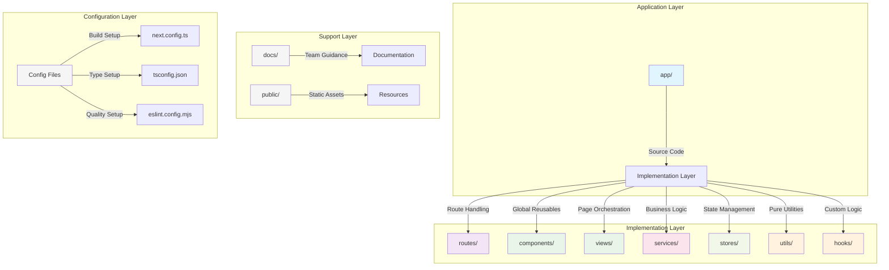
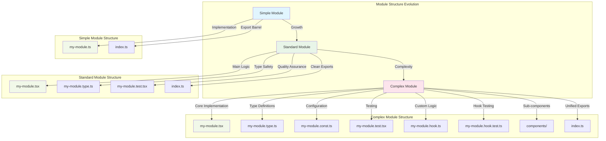
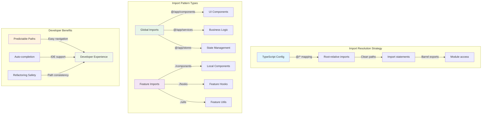
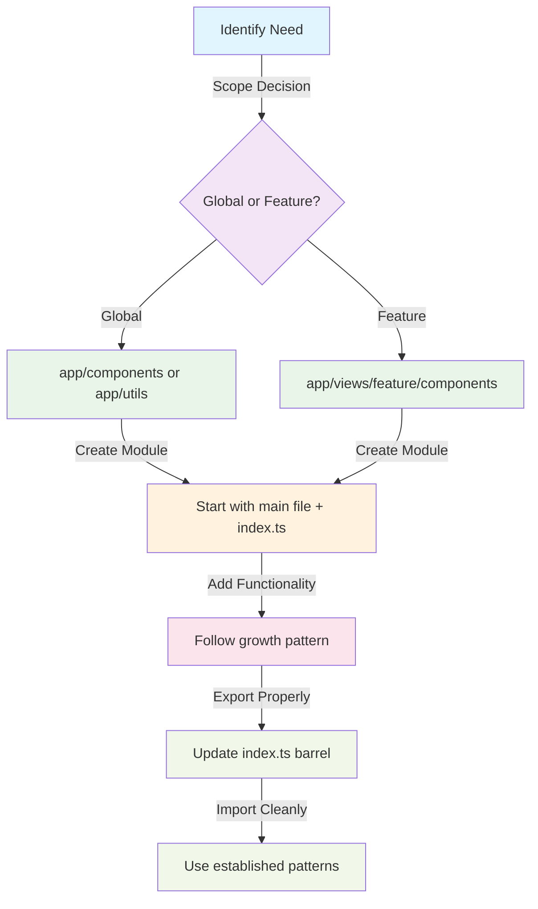

# Code Organization

Codebase organization, architectural patterns, and standardized naming conventions for maintainable project structure.

## Table of Contents

- [Overview](#overview)
- [Naming Conventions](#naming-conventions)
- [Project Structure](#project-structure)
- [Module Organization](#module-organization)
- [Import Strategy](#import-strategy)
- [Implementation Guidelines](#implementation-guidelines)

## Related Documentation

- [Architecture](./architecture.md) - Architectural patterns and component organization principles
- [Testing](./testing.md) - Test organization and file structure patterns
- [Contributing](./contributing.md) - Development workflow and project structure guidelines
- [Examples](./examples.md) - Practical examples of code organization patterns

---

## Overview

The template uses a **systematic organizational structure** that provides predictable patterns for teams while supporting natural growth from simple to complex modules. The organization prioritizes discoverability, maintainability, and consistent developer experience across all project layers.

**Core Organizational Principles:**

- **Predictable Structure**: Consistent patterns across all module types enable teams to navigate unfamiliar code efficiently
- **Natural Growth**: Modules start simple and evolve organically without restructuring overhead
- **Clear Boundaries**: Explicit scope definition prevents coupling issues and supports independent development
- **Import Clarity**: Path mapping and barrel exports provide clean, maintainable import statements

---

## Naming Conventions

### Casing Strategy

The codebase follows a multi-layered casing strategy that serves both technical requirements and developer experience, ensuring consistency across different contexts while maintaining filesystem compatibility and IDE integration.

## Naming Convention Reference

| Context                   | Pattern            | Purpose                      | Examples                           |
| ------------------------- | ------------------ | ---------------------------- | ---------------------------------- |
| **Files & Directories**   | `kebab-case`       | Cross-platform compatibility | `user-profile/`, `button.tsx`      |
| **React Components**      | `PascalCase`       | JSX recognition              | `ViewDashboard`, `UserCard`        |
| **TypeScript Interfaces** | `IPascalCase`      | Type distinction             | `IViewDashboardProps`, `IUserData` |
| **Variables & Functions** | `camelCase`        | JavaScript standard          | `userData`, `formatName()`         |
| **Constants**             | `UPPER_SNAKE_CASE` | Immutable identification     | `USER_PROFILE_CONFIG`              |

**Benefits:** Consistent cross-platform compatibility, immediate IDE context, reduced cognitive load

### Detailed Casing Implementation

| Element Type              | Casing Pattern     | Implementation Purpose                    | Template Example                      |
| ------------------------- | ------------------ | ----------------------------------------- | ------------------------------------- |
| **Files & Directories**   | `kebab-case`       | Filesystem compatibility across platforms | `user-profile/`, `button.tsx`         |
| **React Components**      | `PascalCase`       | JSX component recognition and convention  | `ViewDashboard`, `UserCard`           |
| **Interfaces**            | `IPascalCase`      | Immediate type distinction in IDE         | `IViewDashboardProps`, `IUserData`    |
| **Type Aliases**          | `TPascalCase`      | Type alias identification and clarity     | `TButtonVariant`, `THttpMethod`       |
| **Variables & Functions** | `camelCase`        | Standard JavaScript convention adherence  | `userData`, `formatName()`            |
| **Custom Hooks**          | `useCamelCase`     | React hook convention and recognition     | `useUserProfile`, `useDataHistory`    |
| **Constants**             | `UPPER_SNAKE_CASE` | Immutable value identification            | `USER_PROFILE_CONFIG`, `API_BASE_URL` |

**Implementation Benefits:**

- **Cross-platform Compatibility**: Kebab-case files work consistently across Windows, macOS, and Linux
- **IDE Integration**: Casing patterns provide immediate context about code element types
- **Team Consistency**: Standardized patterns reduce cognitive load during development
- **Tool Integration**: Patterns align with linting rules and formatting automation

**Reference:** These patterns follow [React naming conventions](https://react.dev/learn/thinking-in-react#step-1-break-the-ui-into-a-component-hierarchy) and [TypeScript style guidelines](https://typescript-eslint.io/rules/naming-convention/).

---

## Project Structure

### Layered Directory Architecture

The project structure reflects architectural layers while maintaining clear boundaries between different concerns and usage patterns.

**Root-Level Organization:**



### Directory Purpose and Scope

**Application Structure Breakdown:**

```
app/                                    # Next.js application source
├── (routes)/                          # Route organization
│   ├── (public)/                      # Public access routes
│   │   ├── (home)/                    # Home page route group
│   │   └── (examples)/                # Example implementations
│   ├── (auth)/                        # Authentication routes
│   └── api/                           # API endpoint routes
├── components/                        # Global reusable components
│   ├── structure/                     # Layout and navigation
│   └── ui/                           # Design system elements
├── views/                            # Page implementation components
├── services/                         # Business logic and API integration
├── stores/                           # Global state management
├── hooks/                            # Shared custom hooks
├── utils/                            # Pure utility functions
├── constants/                        # Application-wide constants
├── types/                            # Global type definitions
└── styles/                           # Global styling configuration
```

**Organizational Strategy Benefits:**

- **Clear Boundaries**: Each directory has a specific, non-overlapping responsibility
- **Predictable Location**: Teams can find functionality based on its purpose
- **Scalable Growth**: Structure supports adding new features without reorganization
- **Import Clarity**: Directory structure aligns with import path organization

**Reference:** This structure follows [Next.js App Router conventions](https://nextjs.org/docs/app/building-your-application/routing) with additional organizational layers for scalability.

---

## Module Organization

### Universal Module Structure Pattern

Every module in the codebase follows a consistent internal organization pattern, regardless of its type or complexity. This universal approach enables teams to work efficiently across different parts of the application.

**Standard Module Architecture:**



### Module Pattern Implementation Examples

**Simple Module Example** - Utility functions:

```
cn/
├── cn.ts               # Core utility implementation
├── cn.test.ts          # Testing
└── index.ts            # Clean export barrel
```

**Standard Module Example** - UI components:

```
button/
├── button.tsx          # React component implementation
├── button.type.ts      # TypeScript interfaces and types
├── button.test.tsx     # Component testing with coverage
└── index.ts            # Export barrel with types
```

**Complex Module Example** - Feature components:

```
user-profile/
├── user-profile.tsx          # Main component implementation
├── user-profile.type.ts      # Interface definitions
├── user-profile.const.ts     # Configuration constants
├── user-profile.test.tsx     # Component testing
├── user-profile.hook.ts      # Custom hook logic
├── user-profile.hook.test.ts # Hook-specific testing
└── index.ts                  # Unified export barrel
```

### Module Growth Strategy

**Evolutionary Development Pattern:**

Teams should start with minimal structure and add complexity organically as requirements evolve, rather than creating unnecessary files upfront.

## Module Growth Decision Guide

**Starting Point:** Create `module.ts` + `index.ts`

**Add `module.type.ts` when:**

- ✅ You have 3+ interfaces/types
- ✅ Types are used across multiple files
- ❌ Keep types in main file for 1-2 simple types

**Add `module.const.ts` when:**

- ✅ You have 5+ constants
- ✅ Constants are used by multiple components
- ❌ Keep constants in main file for simple configs

**Add `module.hook.ts` when:**

- ✅ Complex state logic (20+ lines)
- ✅ Hook used by multiple components
- ❌ Keep simple logic in main file

**Add `components/` directory when:**

- ✅ 3+ sub-components needed
- ✅ Sub-components are feature-specific
- ❌ Use global components for reusable elements

**Implementation Guidelines:**

- **Start Minimal**: Begin with only the main implementation and index.ts
- **Add Purposefully**: Create additional files only when they serve a clear organizational need
- **Maintain Consistency**: Follow the same naming patterns regardless of module complexity
- **Export Cleanly**: Always use barrel exports through index.ts for clean imports

### Module Scope Classification

**Global vs Feature-Specific Module Strategy:**

Understanding when to create global versus feature-specific modules prevents unnecessary coupling and supports appropriate reuse patterns.

**Scope Decision Matrix:**

| Module Characteristic | Global Scope                      | Feature-Specific Scope                 |
| --------------------- | --------------------------------- | -------------------------------------- |
| **Usage Pattern**     | Used across 3+ different features | Used exclusively within single feature |
| **Business Logic**    | Application-wide concerns         | Domain-specific functionality          |
| **Dependencies**      | Minimal external dependencies     | Tightly coupled to feature context     |
| **Evolution**         | Stable, foundational patterns     | Evolves with feature requirements      |

**Global Module Examples:**

- `@/components/ui/button` - Used across multiple views and features
- `@/stores/user-preferences` - Application-wide state management
- `@/services/http` - Core infrastructure used throughout app

**Feature-Specific Module Examples:**

- `@/views/dashboard/components/metrics-chart` - Dashboard-specific functionality
- `@/views/profile/components/settings-panel` - Profile-specific implementation

**Benefits of Proper Scope Classification:**

- **Reduced Coupling**: Feature-specific modules avoid unnecessary dependencies
- **Clear Ownership**: Teams know which modules they can modify independently
- **Appropriate Reuse**: Global modules encourage proper abstraction
- **Maintenance Clarity**: Scope boundaries guide refactoring decisions

---

## Import Strategy

### Path Mapping and Import Architecture

The template uses TypeScript path mapping and consistent import patterns to support clean, maintainable code.

**Import Architecture Overview:**



### TypeScript Configuration

**Path Mapping Setup:**

```typescript
// tsconfig.json configuration
{
  "compilerOptions": {
    "paths": {
      "@/*": ["./*"]
    }
  }
}
```

This configuration enables clean imports from the project root, eliminating relative path complexity and supporting reliable refactoring. Learn more about [TypeScript path mapping](https://www.typescriptlang.org/docs/handbook/module-resolution.html#path-mapping).

### Import Pattern Implementation

**Global Module Import Examples:**

```typescript
// Importing global UI components
import Button from '@/app/components/ui/button'
import Spinner from '@/app/components/ui/spinner'

// Importing global services
import { restClient, graphqlClient } from '@/app/services/http'

// Importing global state
import useUserPreferencesStore from '@/app/stores/user-preferences'

// Importing global utilities
import cn from '@/app/utils/cn'
```

**Feature-Specific Import Examples:**

```typescript
// Within a view module, importing local components
import MetricsChart from './components/metrics-chart'
import SettingsPanel from './components/settings-panel'

// Importing feature-specific utilities
import { formatName, formatStatName } from './dashboard.util'
import { DASHBOARD_CONFIG } from './dashboard.const'
```

### Barrel Export Pattern

**Clean Export Strategy:**

Every module implements barrel exports through `index.ts` files, providing clean import interfaces and hiding internal implementation details.

**Export Pattern Examples:**

```typescript
// app/components/ui/button/index.ts
export { default } from './button'
export type { ButtonSize, ButtonVariant, IButtonProps } from './button.type'

// app/stores/user-preferences/index.ts
export { default } from './user-preferences'
export { USER_PREFERENCES_CONFIG } from './user-preferences.const'
export type {
  IUserPreferencesStore,
  TUserPreferenceItem,
} from './user-preferences.type'
```

**Benefits of Barrel Exports:**

- **Clean Imports**: Consumers import from the module root, not internal files
- **Implementation Hiding**: Internal file structure changes don't affect imports
- **Type Safety**: Types and implementations exported together
- **Consistency**: Same import pattern across all modules

**Reference:** This pattern follows [TypeScript module best practices](https://www.typescriptlang.org/docs/handbook/modules.html#export--and-import--require) for maintainable exports.

---

## Implementation Guidelines

### Module Creation Best Practices

**Progressive Module Development:**

Teams should follow established patterns while adapting to specific requirements, ensuring consistency without unnecessary overhead.

**Module Creation Workflow:**



**Implementation Decision Framework:**

1. **Scope Classification**: Determine if the module serves global or feature-specific needs
2. **Complexity Assessment**: Start simple and add files based on actual requirements
3. **Naming Consistency**: Follow established casing patterns for all files and exports
4. **Import Strategy**: Use appropriate import patterns based on module scope
5. **Export Organization**: Implement barrel exports for clean consuming interfaces

### Maintenance and Evolution Strategy

**Sustainable Organizational Growth:**

The template's organizational patterns support long-term maintainability through clear boundaries and evolution strategies.

**Growth Management Principles:**

- **Boundary Respect**: Maintain clear boundaries between global and feature-specific modules
- **Pattern Adherence**: Follow established patterns for new modules to maintain consistency
- **Refactoring Guidelines**: Use organizational structure to guide refactoring decisions
- **Documentation Updates**: Keep organizational documentation current with structural changes

---

## References

| Resource                                                                                    | Description                                                    |
| ------------------------------------------------------------------------------------------- | -------------------------------------------------------------- |
| [Next.js App Router](https://nextjs.org/docs/app)                                           | Official Next.js App Router documentation and file conventions |
| [TypeScript Handbook](https://www.typescriptlang.org/docs/)                                 | Complete TypeScript language documentation                     |
| [React Documentation](https://react.dev/)                                                   | Official React library documentation and patterns              |
| [JavaScript Modules](https://developer.mozilla.org/en-US/docs/Web/JavaScript/Guide/Modules) | MDN guide to ES6 modules and import/export patterns            |
