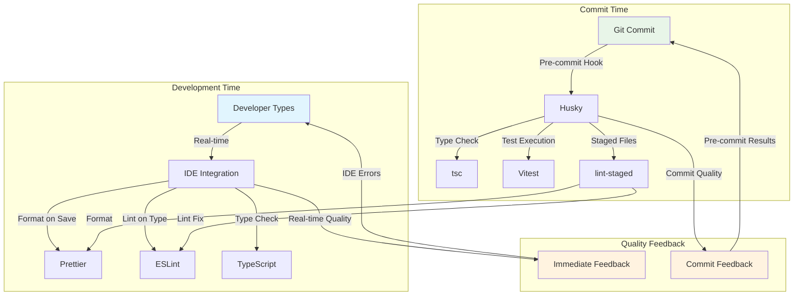
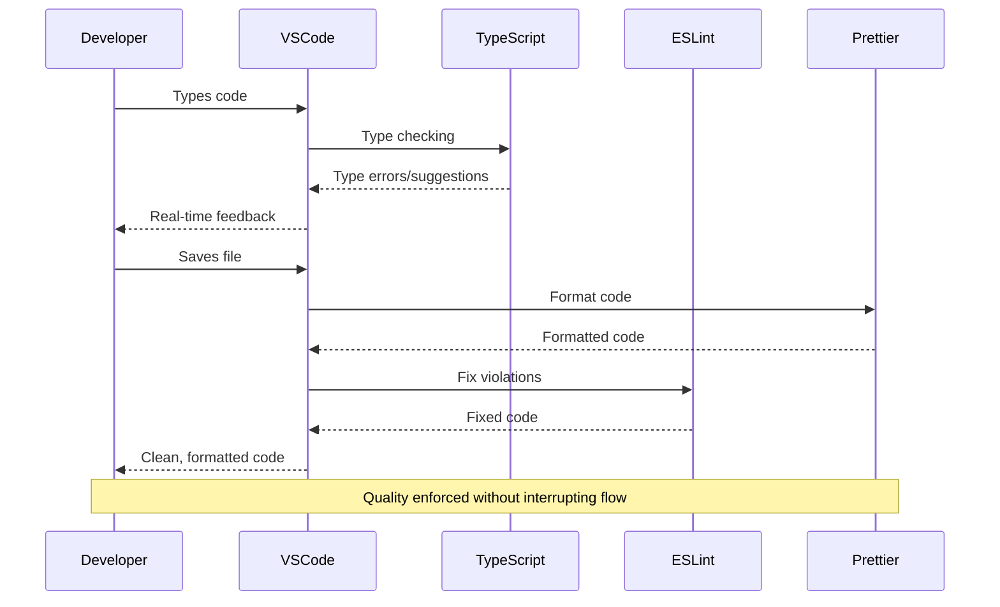
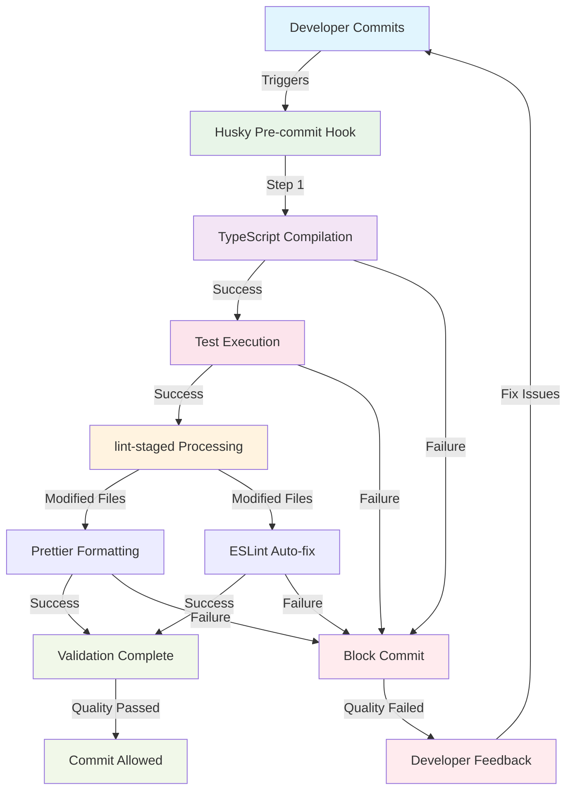
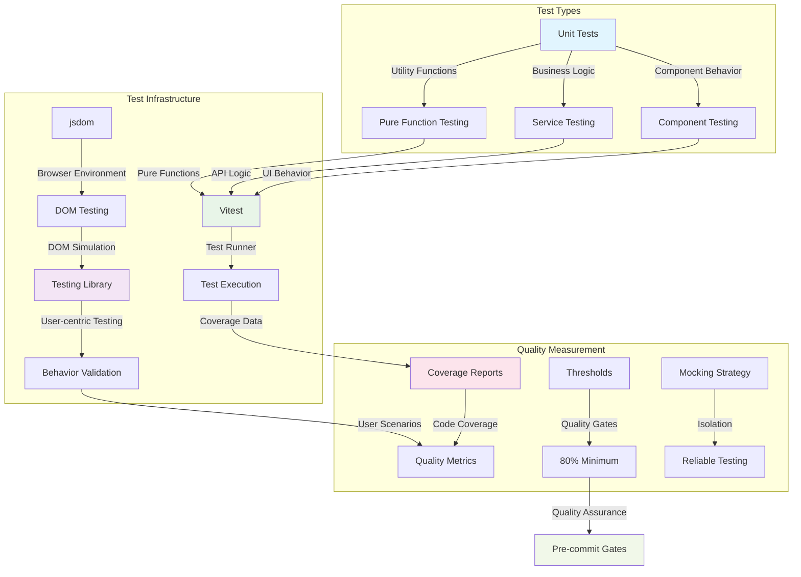

# Code Quality

Code standards enforcement and quality assurance patterns for maintainable development.

## Table of Contents

- [Overview](#overview)
- [Quality Architecture](#quality-architecture)
- [Development Environment Integration](#development-environment-integration)
- [Automated Quality Gates](#automated-quality-gates)
- [Testing Strategy](#testing-strategy)
- [Implementation Guidelines](#implementation-guidelines)

---

## Overview

The template uses automated quality enforcement at multiple stages of the development workflow. Quality issues are detected and resolved early while maintaining developer productivity through automation.

**Live Implementation:** Every file in the codebase demonstrates these quality patterns - from simple utilities with 100% test coverage to complex components with comprehensive accessibility validation.

**Core Quality Principles:**

- **Early Detection**: Quality issues detected and resolved at the point of creation
- **Automated Enforcement**: Tools handle mechanical quality checks, allowing developers to focus on business logic
- **Progressive Enhancement**: Quality systems enhance rather than impede development velocity
- **Comprehensive Coverage**: Multi-layered validation ensures consistent quality across all code types

---

## Quality Architecture

### Multi-Layer Quality Enforcement

Quality enforcement uses multiple layers that work together to maintain code standards throughout the development lifecycle.

**Quality Enforcement Flow:**



**Architecture Benefits:**

- **Layered Defense**: Multiple validation points ensure comprehensive quality coverage
- **Fast Feedback Loops**: Issues caught early in the development process
- **Developer Experience**: Quality enforcement enhances rather than impedes productivity
- **Consistent Standards**: Automated application of quality rules regardless of developer preferences

### Quality Tool Integration Strategy

## Quality Tools Integration Matrix

| Tool            | Primary Function          | Integration Points       | Configuration File  |
| --------------- | ------------------------- | ------------------------ | ------------------- |
| **TypeScript**  | Static type checking      | IDE + Pre-commit         | `tsconfig.json`     |
| **ESLint**      | Code pattern enforcement  | IDE + Pre-commit         | `eslint.config.mjs` |
| **Prettier**    | Code formatting           | IDE + Pre-commit         | `.prettierrc`       |
| **Vitest**      | Test execution & coverage | Development + Pre-commit | `vitest.config.ts`  |
| **Husky**       | Git hook automation       | Pre-commit workflow      | `.husky/pre-commit` |
| **lint-staged** | Targeted file processing  | Pre-commit efficiency    | `.lintstagedrc.mjs` |

**Integration Flow:** Developer saves → IDE formats/lints → Git commit triggers → Husky runs → TypeScript + Tests + lint-staged

### Tool Responsibility Matrix

| Quality Tool    | Primary Function                                      | Integration Point        | Template Configuration                      |
| --------------- | ----------------------------------------------------- | ------------------------ | ------------------------------------------- |
| **TypeScript**  | Static type checking and compile-time validation      | IDE + Pre-commit         | [`tsconfig.json`](../tsconfig.json)         |
| **ESLint**      | Code pattern enforcement and accessibility validation | IDE + Pre-commit         | [`eslint.config.mjs`](../eslint.config.mjs) |
| **Prettier**    | Code formatting and style consistency                 | IDE + Pre-commit         | [`.prettierrc`](../.prettierrc)             |
| **Vitest**      | Test execution and coverage measurement               | Development + Pre-commit | [`vitest.config.ts`](../vitest.config.ts)   |
| **Husky**       | Git hook automation for quality gates                 | Pre-commit workflow      | [`.husky/pre-commit`](../.husky/pre-commit) |
| **lint-staged** | Targeted processing of modified files                 | Pre-commit efficiency    | [`.lintstagedrc.mjs`](../.lintstagedrc.mjs) |

---

## Development Environment Integration

### IDE-First Quality Strategy

The template prioritizes **development-time quality feedback** through comprehensive IDE integration, ensuring quality issues are detected and resolved as developers write code.

**VSCode Quality Integration:**

**Implementation Reference:** [`.vscode/settings.json`](../.vscode/settings.json)

```json
{
  "editor.formatOnSave": true,
  "editor.defaultFormatter": "esbenp.prettier-vscode",
  "editor.codeActionsOnSave": {
    "source.fixAll.eslint": "always"
  },
  "typescript.suggest.autoImports": true,
  "typescript.updateImportsOnFileMove.enabled": "always"
}
```

**Quality Enhancement Features:**

- **Format on Save**: Automatic Prettier formatting ensures consistent style without developer intervention
- **ESLint Auto-fix**: Automatic resolution of fixable quality issues during save operations
- **TypeScript Integration**: Real-time type checking with automatic import management
- **Tailwind CSS Support**: Enhanced autocompletion and validation for utility-first styling

### Real-Time Quality Feedback

**Development Quality Loop:**



**Developer Experience Benefits:**

- **Immediate Feedback**: Quality issues surfaced instantly during development
- **Automatic Resolution**: Many quality issues resolved automatically without developer action
- **Consistent Environment**: Standardized quality experience across team members
- **Reduced Cognitive Load**: Developers focus on business logic while tools handle mechanical quality

**Reference Implementation:** Observe the quality integration by opening any file in the codebase with VSCode - formatting, linting, and type checking happen automatically.

---

## Automated Quality Gates

### Pre-Commit Quality Enforcement

Pre-commit validation prevents quality issues from entering the shared repository while maintaining development velocity through targeted optimization.

**Pre-Commit Workflow Architecture:**



### Husky Configuration Implementation

**Pre-commit Hook Structure:**

**Implementation Reference:** [`.husky/pre-commit`](../.husky/pre-commit)

```bash
npm run tsc      # TypeScript compilation check
npm run test     # Full test suite execution
npx lint-staged  # Targeted file processing
```

**Quality Gate Responsibilities:**

1. **TypeScript Validation**: Ensures type safety across the entire codebase
2. **Test Execution**: Validates behavior and maintains coverage thresholds
3. **Targeted Processing**: Efficiently processes only modified files for optimal performance

### lint-staged Optimization Strategy

**Selective Quality Processing:**

**Implementation Reference:** [`.lintstagedrc.mjs`](../.lintstagedrc.mjs)

```javascript
const lintStagedConfig = {
  '*.{js,jsx,ts,tsx}': [buildFormatCommand, buildLintCommand],
}
```

**Processing Efficiency Benefits:**

- **Targeted Execution**: Only modified files processed, reducing commit time
- **Parallel Processing**: Formatting and linting operations optimized for speed
- **Incremental Quality**: Quality improvements applied incrementally without full codebase processing
- **Developer Productivity**: Fast commit cycles maintain development velocity

### Commit Message Quality

**Conventional Commit Enforcement:**

**Implementation Reference:** [`.commitlintrc.mjs`](../.commitlintrc.mjs)

The template enforces conventional commit standards for:

- **Automated Changelog Generation**: Structured commit history enables automated release notes
- **Semantic Versioning**: Commit types trigger appropriate version bumps
- **Clear Communication**: Standardized commit format improves team communication
- **Tool Integration**: Conventional commits support various automation tools

---

## Testing Strategy

### Comprehensive Testing Architecture

Testing uses coverage thresholds, behavior validation, and testing infrastructure that supports refactoring and feature development.

**Testing Strategy Overview:**



### Coverage Configuration and Thresholds

**Comprehensive Coverage Strategy:**

**Implementation Reference:** [`vitest.config.ts`](../vitest.config.ts)

```typescript
coverage: {
  thresholds: {
    branches: 80,
    functions: 80,
    lines: 80,
    statements: 80,
  },
  include: [
    'app/components/**/*.{ts,tsx}',
    'app/services/**/*.{ts,tsx}',
    'app/stores/**/*.{ts,tsx}',
    'app/utils/**/*.{ts,tsx}',
    'app/views/**/*.{ts,tsx}',
  ],
}
```

**Coverage Strategy Benefits:**

- **Quality Assurance**: 80% minimum coverage ensures adequate testing without excessive overhead
- **Targeted Inclusion**: Focus on business logic while excluding configuration and generated files
- **Multiple Metrics**: Comprehensive coverage measurement across branches, functions, lines, and statements
- **Quality Gates**: Coverage thresholds prevent quality regression in pre-commit validation

### Testing Pattern Implementation

**Component Testing Example:**

**Implementation Reference:** [`app/components/ui/button/button.test.tsx`](../app/components/ui/button/button.test.tsx)

```typescript
describe('Button', () => {
  it('renders correctly with default props', () => {
    render(<Button>Click me</Button>)

    const button = screen.getByRole('button')
    expect(button).toBeInTheDocument()
    expect(button).toHaveTextContent('Click me')
  })

  it('renders with primary variant by default', () => {
    render(<Button>Primary</Button>)

    const button = screen.getByRole('button')
    expect(button).toHaveClass('bg-blue-600')
  })
})
```

**Testing Pattern Characteristics:**

- **User-centric Testing**: Tests focus on behavior rather than implementation details
- **Accessibility Integration**: Tests use semantic queries (getByRole) that ensure accessibility
- **Behavior Validation**: Tests verify user-facing functionality and visual states
- **Comprehensive Coverage**: Tests cover default behavior, variants, sizes, and interactions

### Mock Strategy and Test Isolation

**Test Infrastructure Setup:**

**Implementation Reference:** [`vitest.setup.ts`](../vitest.setup.ts)

```typescript
// Mock Next.js router for consistent testing
vi.mock('next/navigation', () => ({
  useRouter: vi.fn(() => ({
    push: vi.fn(),
    replace: vi.fn(),
    back: vi.fn(),
  })),
  usePathname: vi.fn(() => '/'),
}))
```

**Mocking Strategy Benefits:**

- **Test Isolation**: External dependencies mocked for reliable, fast testing
- **Consistent Environment**: Tests run in predictable environment regardless of external state
- **Framework Integration**: Next.js specific mocks ensure framework features work in tests
- **Performance Optimization**: Mocked dependencies reduce test execution time

---

## Implementation Guidelines

### Quality Enforcement Adaptation

**Template Customization Guidelines:**

Teams can adapt quality standards while maintaining the core enforcement architecture:

**Configuration Adaptation:**

- **ESLint Rules**: Modify [`eslint.config.mjs`](../eslint.config.mjs) to adjust code pattern enforcement
- **Prettier Settings**: Update [`.prettierrc`](../.prettierrc) to match team formatting preferences
- **Coverage Thresholds**: Adjust [`vitest.config.ts`](../vitest.config.ts) thresholds based on project requirements
- **IDE Integration**: Extend [`.vscode/settings.json`](../.vscode/settings.json) for team-specific tooling

**Quality Evolution Strategy:**

- **Incremental Enhancement**: Gradually increase quality standards as team experience grows
- **Tool Integration**: Add quality tools that integrate with existing automation infrastructure
- **Metric Tracking**: Monitor quality metrics to identify areas for improvement
- **Team Feedback**: Adjust quality standards based on team productivity and satisfaction

### Development Workflow Optimization

**Quality-Enhanced Development Process:**

Quality architecture enhances rather than impedes development velocity through automation and early feedback loops.

**Developer Productivity Benefits:**

- **Reduced Debugging Time**: Early detection prevents time-consuming bug hunts
- **Consistent Code Style**: Automated formatting eliminates style discussions
- **Confident Refactoring**: Comprehensive test coverage enables safe code changes
- **Knowledge Sharing**: Quality standards document team conventions and best practices

**Quality Measurement and Improvement:**

- **Coverage Tracking**: Monitor test coverage trends to identify testing gaps
- **Quality Metrics**: Track linting violations and TypeScript errors over time
- **Performance Impact**: Ensure quality tools don't negatively impact development speed
- **Team Satisfaction**: Regular retrospectives on quality tool effectiveness and developer experience
