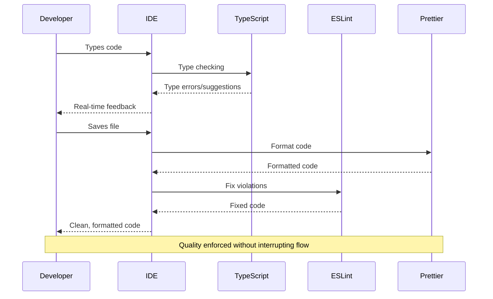

# Code Quality

Code standards enforcement and quality assurance patterns for maintainable development.

## Table of Contents

- [Overview](#overview)
- [Quality Architecture](#quality-architecture)
- [Development Environment Integration](#development-environment-integration)
- [Automated Quality Gates](#automated-quality-gates)
- [Testing Strategy](#testing-strategy)
- [Implementation Guidelines](#implementation-guidelines)

## Related Documentation

- **[Testing](./testing.md)** - Testing framework and quality assurance patterns
- **[Contributing](./contributing.md)** - Development workflow standards and quality requirements
- **[Scripts](./scripts.md)** - Quality assurance scripts and development commands
- **[Examples](./examples.md)** - Quality implementation examples and testing patterns

---

## Overview

The template uses automated quality enforcement at multiple stages of the development workflow. Quality issues are detected and resolved early while maintaining developer productivity through automation.

#### Core Quality Principles

- **Early Detection**: Quality issues detected and resolved at the point of creation
- **Automated Enforcement**: Tools handle mechanical quality checks, allowing developers to focus on business logic
- **Progressive Enhancement**: Quality systems enhance rather than impede development velocity
- **Coverage**: Multi-layered validation ensures consistent quality across all code types

---

## Quality Architecture

### Multi-Layer Quality Enforcement

Quality enforcement uses multiple layers that work together to maintain code standards throughout the development lifecycle.

**Quality Enforcement Flow:**


#### Architecture Benefits

- **Layered Defense**: Multiple validation points ensure quality coverage
- **Fast Feedback Loops**: Issues caught early in the development process
- **Developer Experience**: Quality enforcement enhances rather than impedes productivity
- **Consistent Standards**: Automated application of quality rules regardless of developer preferences

### Quality Tool Integration Strategy

## Quality Tools Integration Matrix

| Tool            | Primary Function          | Integration Points       | Official Documentation                                   |
| --------------- | ------------------------- | ------------------------ | -------------------------------------------------------- |
| **TypeScript**  | Static type checking      | IDE + Pre-commit         | [TypeScript Docs](https://www.typescriptlang.org/docs/)  |
| **ESLint**      | Code pattern enforcement  | IDE + Pre-commit         | [ESLint Documentation](https://eslint.org/docs/latest/)  |
| **Prettier**    | Code formatting           | IDE + Pre-commit         | [Prettier Docs](https://prettier.io/docs/en/)            |
| **Vitest**      | Test execution & coverage | Development + Pre-commit | [Vitest Guide](https://vitest.dev/guide/)                |
| **Husky**       | Git hook automation       | Pre-commit workflow      | [Husky Documentation](https://typicode.github.io/husky/) |
| **lint-staged** | Targeted file processing  | Pre-commit efficiency    | [lint-staged](https://github.com/okonet/lint-staged)     |

**Integration Flow:** Developer saves → IDE formats/lints → Git commit triggers → Husky runs → TypeScript + Tests + lint-staged

### Tool Responsibility Matrix

| Quality Tool    | Primary Function                                      | Integration Point        | Best Practices                                                                                                   |
| --------------- | ----------------------------------------------------- | ------------------------ | ---------------------------------------------------------------------------------------------------------------- |
| **TypeScript**  | Static type checking and compile-time validation      | IDE + Pre-commit         | [TypeScript Best Practices](https://www.typescriptlang.org/docs/handbook/declaration-files/do-s-and-don-ts.html) |
| **ESLint**      | Code pattern enforcement and accessibility validation | IDE + Pre-commit         | [ESLint Configuration](https://eslint.org/docs/latest/use/configure/)                                            |
| **Prettier**    | Code formatting and style consistency                 | IDE + Pre-commit         | [Prettier Configuration](https://prettier.io/docs/en/configuration.html)                                         |
| **Vitest**      | Test execution and coverage measurement               | Development + Pre-commit | [Vitest Configuration](https://vitest.dev/config/)                                                               |
| **Husky**       | Git hook automation for quality gates                 | Pre-commit workflow      | [Husky Setup Guide](https://typicode.github.io/husky/getting-started.html)                                       |
| **lint-staged** | Targeted processing of modified files                 | Pre-commit efficiency    | [lint-staged Usage](https://github.com/okonet/lint-staged#usage)                                                 |

---

## Development Environment Integration

### IDE-First Quality Strategy

The template prioritizes **development-time quality feedback** through IDE integration, ensuring quality issues are detected and resolved as developers write code.

**VSCode Quality Integration:**

For detailed VSCode setup, refer to the [VSCode TypeScript Documentation](https://code.visualstudio.com/docs/languages/typescript) and [ESLint Extension Guide](https://marketplace.visualstudio.com/items?itemName=dbaeumer.vscode-eslint).

```json
{
  "editor.formatOnSave": true,
  "editor.defaultFormatter": "esbenp.prettier-vscode",
  "editor.codeActionsOnSave": {
    "source.fixAll.eslint": "always"
  },
  "typescript.suggest.autoImports": true,
  "typescript.updateImportsOnFileMove.enabled": "always"
}
```

**Quality Enhancement Features:**

- **Format on Save**: Automatic Prettier formatting ensures consistent style without developer intervention
- **ESLint Auto-fix**: Automatic resolution of fixable quality issues during save operations
- **TypeScript Integration**: Real-time type checking with automatic import management
- **Framework Support**: Enhanced autocompletion and validation for your chosen tech stack

### Real-Time Quality Feedback

**Development Quality Loop:**



**Developer Experience Benefits:**

- **Immediate Feedback**: Quality issues surfaced instantly during development
- **Automatic Resolution**: Many quality issues resolved automatically without developer action
- **Consistent Environment**: Standardized quality experience across team members
- **Reduced Cognitive Load**: Developers focus on business logic while tools handle mechanical quality

**Implementation Guidelines:** Configure your IDE with appropriate extensions for TypeScript, ESLint, and Prettier to achieve automatic quality enforcement during development.

---

## Automated Quality Gates

### Pre-Commit Quality Enforcement

Pre-commit validation prevents quality issues from entering the shared repository while maintaining development velocity through targeted optimization.

**Pre-Commit Workflow Architecture:**


### Husky Configuration Implementation

**Pre-commit Hook Structure:**

For comprehensive Husky setup, see the [official Husky documentation](https://typicode.github.io/husky/getting-started.html).

```bash
npm run type-check  # TypeScript compilation check
npm run test        # Full test suite execution
npx lint-staged     # Targeted file processing
```

**Quality Gate Responsibilities:**

1. **TypeScript Validation**: Ensures type safety across the entire codebase
2. **Test Execution**: Validates behavior and maintains coverage thresholds
3. **Targeted Processing**: Efficiently processes only modified files for optimal performance

### lint-staged Optimization Strategy

**Selective Quality Processing:**

For detailed configuration options, refer to the [lint-staged documentation](https://github.com/okonet/lint-staged#configuration).

```javascript
const lintStagedConfig = {
  '*.{js,jsx,ts,tsx}': ['prettier --write', 'eslint --fix', 'git add'],
}
```

**Processing Efficiency Benefits:**

- **Targeted Execution**: Only modified files processed, reducing commit time
- **Parallel Processing**: Formatting and linting operations optimized for speed
- **Incremental Quality**: Quality improvements applied incrementally without full codebase processing
- **Developer Productivity**: Fast commit cycles maintain development velocity

### Commit Message Quality

**Conventional Commit Enforcement:**

The template enforces conventional commit standards using [Conventional Commits](https://www.conventionalcommits.org/) specification for:

- **Automated Changelog Generation**: Structured commit history enables automated release notes
- **Semantic Versioning**: Commit types trigger appropriate version bumps
- **Clear Communication**: Standardized commit format improves team communication
- **Tool Integration**: Conventional commits support various automation tools

Learn more about implementing conventional commits with [commitlint](https://commitlint.js.org/#/).

---

## Testing Strategy

### Testing Architecture

Testing uses coverage thresholds, behavior validation, and testing infrastructure that supports refactoring and feature development.

**Testing Strategy Overview:**


### Coverage Configuration and Thresholds

**Coverage Strategy:**

For detailed coverage configuration, see the [Vitest Coverage Guide](https://vitest.dev/guide/coverage.html).

```typescript
coverage: {
  thresholds: {
    branches: 80,
    functions: 80,
    lines: 80,
    statements: 80,
  },
  include: [
    'src/components/**/*.{ts,tsx}',
    'src/services/**/*.{ts,tsx}',
    'src/stores/**/*.{ts,tsx}',
    'src/utils/**/*.{ts,tsx}',
    'src/views/**/*.{ts,tsx}',
  ],
}
```

**Coverage Strategy Benefits:**

- **Quality Assurance**: 80% minimum coverage ensures adequate testing without excessive overhead
- **Targeted Inclusion**: Focus on business logic while excluding configuration and generated files
- **Multiple Metrics**: Coverage measurement across branches, functions, lines, and statements
- **Quality Gates**: Coverage thresholds prevent quality regression in pre-commit validation

### Testing Pattern Implementation

**Component Testing Example:**

Following [Testing Library best practices](https://testing-library.com/docs/guiding-principles) for user-centric testing:

```typescript
describe('Button Component', () => {
  it('renders correctly with default props', () => {
    render(<Button>Click me</Button>)

    const button = screen.getByRole('button')
    expect(button).toBeInTheDocument()
    expect(button).toHaveTextContent('Click me')
  })

  it('renders with primary variant by default', () => {
    render(<Button>Primary</Button>)

    const button = screen.getByRole('button')
    expect(button).toHaveClass('primary-button-class')
  })

  it('handles click interactions', async () => {
    const handleClick = vi.fn()
    render(<Button onClick={handleClick}>Click me</Button>)

    const button = screen.getByRole('button')
    await user.click(button)

    expect(handleClick).toHaveBeenCalledTimes(1)
  })
})
```

**Testing Pattern Characteristics:**

- **User-centric Testing**: Tests focus on behavior rather than implementation details
- **Accessibility Integration**: Tests use semantic queries (getByRole) that ensure accessibility
- **Behavior Validation**: Tests verify user-facing functionality and visual states
- **Coverage**: Tests cover default behavior, variants, sizes, and interactions

### Mock Strategy and Test Isolation

**Test Infrastructure Setup:**

For mocking strategies, see the [Vitest Mocking Guide](https://vitest.dev/guide/mocking.html).

```typescript
// Mock external dependencies for consistent testing
vi.mock('external-library', () => ({
  useExternalHook: vi.fn(() => ({
    data: null,
    loading: false,
    error: null,
  })),
}))

// Mock navigation for routing tests
vi.mock('your-router-library', () => ({
  useRouter: vi.fn(() => ({
    push: vi.fn(),
    replace: vi.fn(),
    back: vi.fn(),
  })),
  usePathname: vi.fn(() => '/'),
}))
```

**Mocking Strategy Benefits:**

- **Test Isolation**: External dependencies mocked for reliable, fast testing
- **Consistent Environment**: Tests run in predictable environment regardless of external state
- **Framework Integration**: Framework-specific mocks ensure features work correctly in tests
- **Performance Optimization**: Mocked dependencies reduce test execution time

---

## Implementation Guidelines

### Quality Enforcement Adaptation

**Quality Configuration Guidelines:**

Teams can adapt quality standards while maintaining the core enforcement architecture:

**Configuration Adaptation:**

- **ESLint Rules**: Modify ESLint configuration to adjust code pattern enforcement based on [ESLint rules documentation](https://eslint.org/docs/latest/rules/)
- **Prettier Settings**: Update Prettier configuration to match team formatting preferences using [Prettier options](https://prettier.io/docs/en/options.html)
- **Coverage Thresholds**: Adjust Vitest coverage thresholds based on project requirements following [Vitest coverage configuration](https://vitest.dev/config/#coverage)
- **IDE Integration**: Extend IDE settings for team-specific tooling and extensions

**Quality Evolution Strategy:**

- **Incremental Enhancement**: Gradually increase quality standards as team experience grows
- **Tool Integration**: Add quality tools that integrate with existing automation infrastructure
- **Metric Tracking**: Monitor quality metrics to identify areas for improvement
- **Team Feedback**: Adjust quality standards based on team productivity and satisfaction

### Development Workflow Optimization

**Quality-Enhanced Development Process:**

Quality architecture enhances rather than impedes development velocity through automation and early feedback loops.

**Developer Productivity Benefits:**

- **Reduced Debugging Time**: Early detection prevents time-consuming bug hunts
- **Consistent Code Style**: Automated formatting eliminates style discussions
- **Confident Refactoring**: Test coverage enables safe code changes
- **Knowledge Sharing**: Quality standards document team conventions and best practices

**Quality Measurement and Improvement:**

- **Coverage Tracking**: Monitor test coverage trends to identify testing gaps
- **Quality Metrics**: Track linting violations and TypeScript errors over time
- **Performance Impact**: Ensure quality tools don't negatively impact development speed
- **Team Satisfaction**: Regular retrospectives on quality tool effectiveness and developer experience

### Tool Selection and Configuration

#### Quality Tool Evaluation Criteria

When selecting or updating quality tools, consider:

- **Integration Capability**: How well the tool integrates with existing development workflow
- **Performance Impact**: Tool overhead on development and build processes
- **Team Adoption**: Learning curve and developer experience considerations
- **Maintenance Requirements**: Ongoing configuration and update requirements

#### Recommended Tool Combinations

- **TypeScript + ESLint**: Type safety with code pattern enforcement
- **Prettier + ESLint**: Formatting consistency with customizable code rules
- **Vitest + Testing Library**: Fast testing with user-centric validation
- **Husky + lint-staged**: Automated quality gates with performance optimization

---

## References

| Resource                                                             | Description                                             |
| -------------------------------------------------------------------- | ------------------------------------------------------- |
| [TypeScript Documentation](https://www.typescriptlang.org/docs/)     | Official TypeScript language and compiler documentation |
| [ESLint Documentation](https://eslint.org/docs/latest/)              | ESLint rules, configuration, and usage guide            |
| [ESLint Rules](https://eslint.org/docs/latest/rules/)                | Complete reference for available ESLint rules           |
| [Prettier Documentation](https://prettier.io/docs/en/)               | Code formatter configuration and options                |
| [Prettier Options](https://prettier.io/docs/en/options.html)         | Detailed configuration options for Prettier             |
| [Vitest Documentation](https://vitest.dev/)                          | Fast testing framework with TypeScript support          |
| [Vitest Coverage Configuration](https://vitest.dev/config/#coverage) | Coverage reporting setup and thresholds                 |
| [Testing Library](https://testing-library.com/)                      | User-centric testing utilities and best practices       |
| [Husky Documentation](https://typicode.github.io/husky/)             | Git hooks for automation and quality gates              |
| [lint-staged](https://github.com/okonet/lint-staged)                 | Run linters on pre-committed files                      |
| [Conventional Commits](https://www.conventionalcommits.org/)         | Specification for structured commit messages            |
