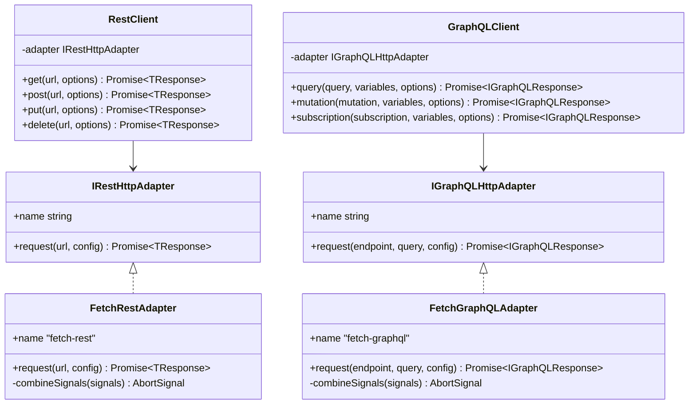
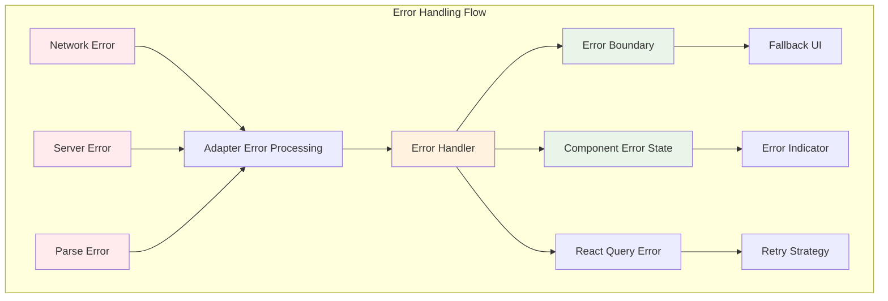

# Data Fetching

Strategic patterns for API integration and server state management that balance developer experience with application performance.

## Table of Contents

- [HTTP Service Architecture](#http-service-architecture)
- [Adapter Pattern Implementation](#adapter-pattern-implementation)
- [Client Configuration](#client-configuration)
- [React Query Integration](#react-query-integration)
- [Error Handling Strategies](#error-handling-strategies)
- [Performance Considerations](#performance-considerations)
- [Real-World Examples](#real-world-examples)
- [Testing Data Fetching](#testing-data-fetching)
- [Extending the System](#extending-the-system)

## HTTP Service Architecture

The template organizes data fetching around a layered architecture that separates concerns between transport protocols, caching strategies, and state management. This design enables teams to work with different APIs while maintaining consistent patterns across the application.

## HTTP Service Architecture Stack

**Application Layer**

- React Query Hooks ← Components

**Service Layer**

- REST Client, GraphQL Client

**Adapter Layer**

- Fetch REST Adapter, Fetch GraphQL Adapter

**Transport Layer**

- Fetch API → HTTP/HTTPS

**Data Flow:** Components → React Query → REST/GraphQL Clients → Fetch Adapters → Fetch API → Network

**Benefits:** Clear separation of concerns, consistent interfaces, flexible implementation swapping

This layered approach provides clear separation of concerns. Components work through React Query hooks to access data, while the service layer manages protocol-specific concerns. The adapter layer enables flexibility in HTTP implementations, and the transport layer handles the actual network communication.

### Core Design Principles

The HTTP service follows several design principles that teams should understand when extending or modifying the data fetching layer:

**Interface Standardization**: Both REST and GraphQL clients implement consistent interfaces, allowing teams to switch between protocols without changing application logic. The `IRestHttpAdapter` and `IGraphQLHttpAdapter` interfaces define contracts that any implementation must follow.

**Dependency Injection**: The template uses factory functions in `HTTP_ADAPTER_CONFIG` to inject adapters at runtime. This pattern enables testing with mock adapters and production flexibility without tight coupling to specific implementations.

**Error Consistency**: All adapters handle errors through the same error processing pipeline, ensuring uniform error handling regardless of the underlying HTTP library or protocol.

**Caching Integration**: The adapter interfaces include Next.js-specific caching options (`revalidate`, `tags`) that integrate seamlessly with the framework's caching layer while remaining abstracted from business logic.

## Adapter Pattern Implementation

The template implements the adapter pattern to provide a stable interface for HTTP communication while allowing flexibility in the underlying implementation. This pattern enables teams to swap HTTP libraries, add authentication layers, or integrate specialized functionality without disrupting existing code.



### Interface Definition

The adapter interfaces define the contract that any HTTP implementation must follow. Located in `app/services/http/core/core.type.ts`, these interfaces ensure consistency across different implementations:

```typescript
export interface IRestHttpAdapter {
  request<TResponse>(
    url: string,
    config: IHttpRequestConfig,
  ): Promise<TResponse>
  readonly name: string
}

export interface IGraphQLHttpAdapter {
  request<TResponse>(
    endpoint: string,
    query: string,
    config: IGraphQLRequestConfig,
  ): Promise<IGraphQLResponse<TResponse>>
  readonly name: string
}
```

### Default Fetch Implementation

The template includes fetch-based adapters that handle the most common use cases. The `FetchRestAdapter` in `app/services/http/rest/adapters/fetch-rest.ts` demonstrates the standard implementation pattern:

```typescript
export class FetchRestAdapter implements IRestHttpAdapter {
  readonly name = 'fetch-rest'

  async request<TResponse>(
    url: string,
    config: IHttpRequestConfig,
  ): Promise<TResponse> {
    const {
      method,
      body,
      headers,
      timeout,
      tags = [],
      revalidate,
      signal: externalSignal,
      ...restOptions
    } = config

    const finalHeaders = createHeaders(headers)
    const timeoutSignal = createTimeoutSignal(timeout)
    const signal = this.combineSignals(externalSignal, timeoutSignal)

    const requestInit: RequestInit = {
      method,
      headers: finalHeaders,
      signal,
      ...restOptions,
    }

    if (body && method !== 'GET' && method !== 'DELETE') {
      requestInit.body = JSON.stringify(body)
    }

    // Next.js caching integration
    if (tags.length > 0 || revalidate !== undefined) {
      requestInit.next = { tags, revalidate }
    }

    const response = await fetch(url, requestInit)
    return processResponse<TResponse>(response)
  }
}
```

This implementation handles signal combination for timeout and cancellation, integrates with Next.js caching, and processes responses through the standard error handling pipeline.

### Configuration and Factory Pattern

The `HTTP_ADAPTER_CONFIG` in `app/services/http/core/core.ts` uses factory functions to configure adapters:

```typescript
export const HTTP_ADAPTER_CONFIG: {
  restAdapter: TRestAdapterFactory
  graphqlAdapter: TGraphQLAdapterFactory
} = {
  restAdapter: () => new FetchRestAdapter(),
  graphqlAdapter: () => new FetchGraphQLAdapter(),
}
```

Teams can modify this configuration to use different adapters without changing client code. For example, to use an axios-based adapter:

```typescript
export const HTTP_ADAPTER_CONFIG = {
  restAdapter: () => new AxiosRestAdapter(),
  graphqlAdapter: () => new FetchGraphQLAdapter(),
}
```

## Client Configuration

The template provides two singleton clients that handle protocol-specific concerns while maintaining consistent interfaces for application code.

### REST Client

The `RestClient` class in `app/services/http/rest/rest.ts` provides methods for common HTTP operations:

```typescript
class RestClient {
  private adapter: IRestHttpAdapter

  constructor() {
    const adapterFactory = HTTP_ADAPTER_CONFIG.restAdapter
    this.adapter = adapterFactory()
  }

  async get<TResponse>(
    path: string,
    options: IRestRequestOptions = {},
  ): Promise<TResponse> {
    const { baseUrl, ...restOptions } = options
    const finalBaseUrl = resolveBaseUrl(baseUrl)
    const url = buildUrl(finalBaseUrl, path)

    return this.adapter.request<TResponse>(url, {
      method: 'GET',
      ...restOptions,
    })
  }

  async post<TResponse>(
    path: string,
    options: IRestRequestOptions = {},
  ): Promise<TResponse> {
    // Implementation follows same pattern
  }
}

export const restClient = new RestClient()
```

Teams access the REST client as a singleton instance, ensuring consistent configuration across the application. The real-world Pokemon detail query from `app/(routes)/(public)/(examples)/pokemons/[pokemon]/queries/get-pokemon-detail.query.ts` demonstrates typical usage:

```typescript
const getPokemonDetailData = async (name: string) => {
  try {
    const response = await restClient.get<IPokemonDetail>(
      `/pokemon/${name.toLowerCase()}`,
      {
        baseUrl: 'https://pokeapi.co/api/v2',
        revalidate: 3600, // 1 hour cache
      },
    )

    return {
      success: true,
      data: response,
      error: null,
    }
  } catch (error) {
    console.error(`Error fetching Pokémon ${name}:`, error)
    return {
      success: false,
      data: null,
      error: error instanceof Error ? error.message : 'Unknown error',
    }
  }
}
```

### GraphQL Client

The `GraphQLClient` provides query, mutation, and subscription methods with consistent error handling:

```typescript
class GraphQLClient {
  private adapter: IGraphQLHttpAdapter

  async query<TResponse, TVariables = Record<string, unknown>>(
    query: string,
    variables?: TVariables,
    options?: Omit<IGraphQLRequestOptions<TVariables>, 'variables'>,
  ) {
    return this.request<TResponse, TVariables>(query, { ...options, variables })
  }

  async mutation<TResponse, TVariables = Record<string, unknown>>(
    mutation: string,
    variables?: TVariables,
    options?: Omit<IGraphQLRequestOptions<TVariables>, 'variables'>,
  ) {
    return this.request<TResponse, TVariables>(mutation, {
      ...options,
      variables,
    })
  }
}

export const graphqlClient = new GraphQLClient()
```

The Pokemon list query from `app/(routes)/(public)/(examples)/pokemons/queries/get-pokemons.query.ts` shows typical GraphQL usage:

```typescript
const getPokemonsData = async (limit: number = 8, offset: number = 0) => {
  try {
    const response = await graphqlClient.query<IPokemonsResponse>(
      GET_POKEMONS,
      {
        limit,
        offset,
      },
      {
        baseUrl: 'https://graphql-pokeapi.graphcdn.app/graphql',
        revalidate: 300, // 5 minutes cache
      },
    )

    return {
      success: true,
      data: response.data?.pokemons?.results || [],
      count: response.data?.pokemons?.count || 0,
      next: response.data?.pokemons?.next || null,
      previous: response.data?.pokemons?.previous || null,
    }
  } catch (error) {
    console.error('Error fetching Pokémon:', error)
    return {
      success: false,
      data: [],
      count: 0,
      next: null,
      previous: null,
      error: error instanceof Error ? error.message : 'Unknown error',
    }
  }
}
```

## React Query Integration

The template integrates TanStack Query for server state management, providing caching, background updates, and optimistic updates. The `HttpProvider` in `app/services/http/providers/react-query.tsx` configures the QueryClient with opinionated defaults that prioritize development experience:

```typescript
export const HttpProvider = ({ children }: HttpProviderProps) => {
  const [queryClient] = useState(() => {
    return new QueryClient({
      defaultOptions: {
        queries: {
          staleTime: HTTP_CONFIG.DEFAULT_STALE_TIME, // 5 minutes
          retry: HTTP_CONFIG.DEFAULT_RETRY_COUNT,    // 1 retry
          refetchOnWindowFocus: false,
          refetchOnReconnect: 'always',
        },
        mutations: {
          retry: false,
        },
      },
    })
  })

  return (
    <QueryClientProvider client={queryClient}>{children}</QueryClientProvider>
  )
}
```

### Hook Implementation Patterns

The template establishes consistent patterns for implementing data fetching hooks. The Pokemon moves hook from `app/views/pokemon/components/pokemon-moves/pokemon-moves.hook.ts` demonstrates the standard structure:

```typescript
const usePokemonMovesGraphQL = (
  pokemonName: string,
  options?: TUsePokemonMovesGraphQLOptions,
): TUsePokemonMovesGraphQLReturn => {
  const { data, isLoading, isError, error, refetch, isFetching } = useQuery({
    queryKey: [POKEMON_MOVES_GRAPHQL_QUERY_KEY, pokemonName],
    queryFn: () => fetchPokemonMovesGraphQL(pokemonName),
    staleTime:
      POKEMON_MOVES_GRAPHQL_CONFIG.POKEMON_MOVES_GRAPHQL_CACHE_MINUTES *
      60 *
      1000,
    gcTime:
      POKEMON_MOVES_GRAPHQL_CONFIG.POKEMON_MOVES_GRAPHQL_GC_MINUTES * 60 * 1000,
    retry: POKEMON_MOVES_GRAPHQL_CONFIG.RETRY_COUNT,
    enabled: options?.enabled,
  })

  return {
    pokemonMoves: data,
    isLoading,
    isError,
    error,
    refetch,
    isFetching,
  }
}
```

### Infinite Queries

For paginated data, the template uses infinite queries. The Pokemon list implementation in `app/views/pokemons/pokemons.hook.ts` shows the pattern:

```typescript
export const useMorePokemons = ({
  initialOffset = 8,
}: TUseMorePokemonsOptions = {}) => {
  return useInfiniteQuery({
    queryKey: POKEMONS_QUERY_CONFIG.QUERY_KEY,
    queryFn: async ({ pageParam = initialOffset }) => {
      const response = await graphqlClient.query<IPokemonsResponse>(
        GET_POKEMONS,
        {
          limit: POKEMONS_PER_PAGE,
          offset: pageParam,
        },
        {
          baseUrl: 'https://graphql-pokeapi.graphcdn.app/',
        },
      )

      return {
        data: response.data?.pokemons?.results || [],
        count: response.data?.pokemons?.count || 0,
        next: response.data?.pokemons?.next || null,
        previous: response.data?.pokemons?.previous || null,
        nextOffset: pageParam + POKEMONS_PER_PAGE,
      }
    },
    initialPageParam: initialOffset,
    getNextPageParam: (lastPage) => {
      const totalLoaded = lastPage.nextOffset
      const totalCount = lastPage.count

      return totalLoaded < totalCount ? lastPage.nextOffset : undefined
    },
    staleTime: POKEMONS_QUERY_CONFIG.STALE_TIME,
    enabled: false,
  })
}
```

## Error Handling Strategies

The template implements a multi-layered error handling approach that provides consistent error experiences across different failure scenarios.



### Adapter Level Error Handling

The `processResponse` utility in `app/services/http/core/core.utils.ts` handles HTTP errors consistently across all adapters:

```typescript
export const processResponse = async <T>(response: Response): Promise<T> => {
  if (!response.ok) {
    const error: IHttpError = {
      message: response.statusText || 'Request failed',
      status: response.status,
    }

    try {
      const errorBody = await response.json()
      error.details = errorBody
      if (errorBody.message) {
        error.message = errorBody.message
      }
      if (errorBody.code) {
        error.code = errorBody.code
      }
    } catch {}

    throw error
  }

  try {
    return await response.json()
  } catch {
    return {} as T
  }
}
```

### Component Error Handling

Components handle errors through standardized patterns that provide user feedback while maintaining functionality. The Pokemon moves component from `app/views/pokemon/components/pokemon-moves/pokemon-moves.tsx` demonstrates the approach:

```typescript
const PokemonMoves = ({ pokemonName }: IPokemonMovesGraphQLProps) => {
  const { pokemonMoves, isError, error, isFetching } = usePokemonMovesGraphQL(
    pokemonName,
    { enabled: true },
  )

  if (isFetching) {
    return (
      <div className='rounded-xl border border-gray-300 bg-white p-6 shadow-lg'>
        <div className='mb-4 flex items-center justify-between'>
          <h2 className='text-xl font-bold text-black'>Moves</h2>
          <div className='rounded-full border border-gray-300 bg-gray-100 px-3 py-1 text-xs text-gray-700'>
            ✨ GraphQL Client-side
          </div>
        </div>
        <Spinner text='Loading moves via GraphQL...' />
      </div>
    )
  }

  if (isError || !pokemonMoves) {
    return (
      <div className='rounded-xl border border-gray-300 bg-white p-6 shadow-lg'>
        <div className='mb-4 flex items-center justify-between'>
          <h2 className='text-xl font-bold text-black'>Moves</h2>
          <div className='rounded-full border border-gray-300 bg-gray-100 px-3 py-1 text-xs text-gray-700'>
            ❌ GraphQL Error
          </div>
        </div>
        <div className='rounded-lg border border-gray-300 bg-gray-50 p-6 text-center'>
          <p className='text-gray-600'>
            {error?.message || ERROR_MESSAGES.POKEMON_MOVES_GRAPHQL_FAILED}
          </p>
        </div>
      </div>
    )
  }

  // Render success state
}
```

This pattern ensures that errors are handled gracefully without breaking the overall user interface.

## Performance Considerations

The template provides several strategies for optimizing data fetching performance beyond caching (detailed caching strategies are covered in the [Caching documentation](./caching.md)).

### Request Optimization

Minimize network overhead through intelligent request patterns:

```typescript
// Request deduplication (automatic with React Query)
const PokemonDisplay: React.FC = () => {
  // Both requests for the same data are automatically deduped
  const pokemon1 = usePokemonSpecies(25)
  const pokemon2 = usePokemonSpecies(25) // No additional network request

  return <PokemonCards pokemon1={pokemon1.data} pokemon2={pokemon2.data} />
}

// Request batching for related data
const usePokemonWithRelatedData = (pokemonName: string) => {
  const pokemonDetail = usePokemonDetail(pokemonName)
  const pokemonMoves = usePokemonMovesGraphQL(pokemonName, {
    enabled: !!pokemonDetail.data?.name
  })

  return {
    pokemon: pokemonDetail.data,
    moves: pokemonMoves.pokemonMoves,
    isLoading: pokemonDetail.isLoading || pokemonMoves.isLoading,
  }
}
```

## Real-World Examples

The template includes working examples that demonstrate data fetching patterns in realistic scenarios.

### Pokemon Detail with Species Information

The Pokemon detail page combines REST and GraphQL queries to display comprehensive information. The species hook from `app/views/pokemon/components/pokemon-species-info/pokemon-species-info.hook.ts` shows how to implement dependent queries:

```typescript
const usePokemonSpecies = (
  pokemonId: number | undefined,
  options: TUsePokemonSpeciesOptions = {},
): TUsePokemonSpeciesReturn => {
  const { enabled = true } = options

  const {
    data: species,
    isLoading,
    isError,
    error,
    refetch,
    isFetching,
  } = useQuery({
    queryKey: [POKEMON_SPECIES_QUERY_KEY, pokemonId],
    queryFn: () => fetchPokemonSpecies(pokemonId!),
    enabled: enabled && !!pokemonId, // Only fetch when ID is available
    staleTime: 1000 * 60 * POKEMON_SPECIES_CONFIG.SPECIES_CACHE_MINUTES,
    gcTime: 1000 * 60 * POKEMON_SPECIES_CONFIG.SPECIES_GC_MINUTES,
    retry: POKEMON_SPECIES_CONFIG.RETRY_COUNT,
  })

  return {
    species,
    isLoading,
    isError,
    error,
    refetch,
    isFetching,
  }
}
```

### DatoCMS Integration

The DatoCMS example in `app/(routes)/(public)/(examples)/datocms/queries/get-datocms.query.ts` demonstrates authenticated GraphQL queries:

```typescript
const getDatocmsData = async () => {
  try {
    const response = await graphqlClient.query<IDatocmsResponse>(
      GET_DATOCMS_QUERY,
      {},
      {
        baseUrl: 'https://graphql.datocms.com/',
        revalidate: 300, // 5 minutes
        headers: {
          Authorization: `Bearer ${process.env.DATOCMS_API_TOKEN}`,
        },
      },
    )

    return {
      success: true,
      data: response.data,
    }
  } catch (error) {
    console.error('Error fetching datocms:', error)
    return {
      success: false,
      error: error instanceof Error ? error.message : 'Unknown error',
    }
  }
}
```

## Testing Data Fetching

The template includes testing utilities and patterns for reliable data fetching tests that don't depend on external services.

### Mock Strategy

Testing focuses on behavior rather than implementation details. Mock the HTTP clients rather than individual fetch calls:

```typescript
// Mock the entire HTTP client
vi.mock('@/app/services/http', () => ({
  restClient: {
    get: vi.fn(),
    post: vi.fn(),
    put: vi.fn(),
    delete: vi.fn(),
  },
  graphqlClient: {
    query: vi.fn(),
    mutation: vi.fn(),
    subscription: vi.fn(),
  },
}))

// Test hook behavior
describe('usePokemonSpecies', () => {
  it('should handle successful data fetch', async () => {
    const mockData = {
      id: 25,
      name: 'pikachu',
      evolution_chain: { url: 'https://pokeapi.co/api/v2/evolution-chain/10/' },
    }

    restClient.get.mockResolvedValue(mockData)

    const { result } = renderHook(() => usePokemonSpecies(25), {
      wrapper: createQueryWrapper(),
    })

    await waitFor(() => {
      expect(result.current.species).toEqual(mockData)
      expect(result.current.isLoading).toBe(false)
      expect(result.current.isError).toBe(false)
    })
  })

  it('should handle error states', async () => {
    const errorMessage = 'Network error'
    restClient.get.mockRejectedValue(new Error(errorMessage))

    const { result } = renderHook(() => usePokemonSpecies(25), {
      wrapper: createQueryWrapper(),
    })

    await waitFor(() => {
      expect(result.current.isError).toBe(true)
      expect(result.current.error?.message).toBe(errorMessage)
    })
  })
})
```

### Test Utilities

Create utilities for common testing scenarios:

```typescript
// Query wrapper for React Query tests
export const createQueryWrapper = () => {
  const queryClient = new QueryClient({
    defaultOptions: {
      queries: { retry: false },
      mutations: { retry: false },
    },
  })

  return ({ children }: { children: React.ReactNode }) => (
    <QueryClientProvider client={queryClient}>{children}</QueryClientProvider>
  )
}

// Mock data factories
export const createMockPokemon = (overrides: Partial<IPokemonDetail> = {}): IPokemonDetail => ({
  id: 25,
  name: 'pikachu',
  height: 4,
  weight: 60,
  base_experience: 112,
  order: 35,
  is_default: true,
  abilities: [],
  types: [],
  stats: [],
  sprites: {
    front_default: 'https://example.com/pikachu.png',
    back_default: null,
  },
  moves: [],
  species: {
    name: 'pikachu',
    url: 'https://pokeapi.co/api/v2/pokemon-species/25/',
  },
  ...overrides,
})
```

## Extending the System

Teams can extend the data fetching system in several ways without breaking existing functionality.

### Custom Adapters

Create adapters for specialized requirements:

```typescript
// Example: Adapter with automatic retry logic
export class RetryRestAdapter implements IRestHttpAdapter {
  readonly name = 'retry-rest'
  private maxRetries = 3
  private retryDelay = 1000

  async request<TResponse>(
    url: string,
    config: IHttpRequestConfig,
  ): Promise<TResponse> {
    let lastError: Error

    for (let attempt = 0; attempt <= this.maxRetries; attempt++) {
      try {
        return await this.executeRequest<TResponse>(url, config)
      } catch (error) {
        lastError = error as Error

        if (attempt < this.maxRetries && this.shouldRetry(error)) {
          await this.delay(this.retryDelay * Math.pow(2, attempt))
          continue
        }

        throw error
      }
    }

    throw lastError!
  }

  private shouldRetry(error: any): boolean {
    // Retry on network errors or 5xx status codes
    return !error.status || error.status >= 500
  }

  private async delay(ms: number): Promise<void> {
    return new Promise((resolve) => setTimeout(resolve, ms))
  }
}
```

### Authentication Integration

Add authentication to HTTP requests:

```typescript
export class AuthenticatedAdapter implements IRestHttpAdapter {
  readonly name = 'authenticated-rest'

  constructor(private tokenProvider: () => Promise<string>) {}

  async request<TResponse>(
    url: string,
    config: IHttpRequestConfig,
  ): Promise<TResponse> {
    const token = await this.tokenProvider()

    const authHeaders = {
      ...config.headers,
      Authorization: `Bearer ${token}`,
    }

    return fetch(url, {
      ...config,
      headers: authHeaders,
    }).then(processResponse)
  }
}
```

### Monitoring and Analytics

Integrate request monitoring:

```typescript
export class MonitoredAdapter implements IRestHttpAdapter {
  readonly name = 'monitored-rest'

  constructor(
    private baseAdapter: IRestHttpAdapter,
    private analytics: AnalyticsService,
  ) {}

  async request<TResponse>(
    url: string,
    config: IHttpRequestConfig,
  ): Promise<TResponse> {
    const startTime = Date.now()

    try {
      const result = await this.baseAdapter.request<TResponse>(url, config)

      this.analytics.track('http_request_success', {
        url,
        method: config.method,
        duration: Date.now() - startTime,
      })

      return result
    } catch (error) {
      this.analytics.track('http_request_error', {
        url,
        method: config.method,
        error: error.message,
        duration: Date.now() - startTime,
      })

      throw error
    }
  }
}
```

The adapter pattern makes these extensions straightforward to implement and test without affecting existing functionality. Teams can compose multiple adapters or switch implementations based on environment or feature flags.
