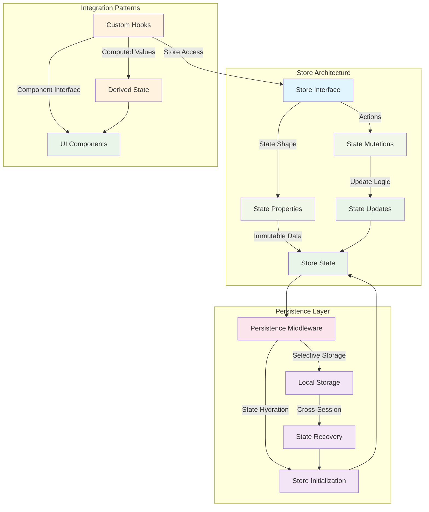
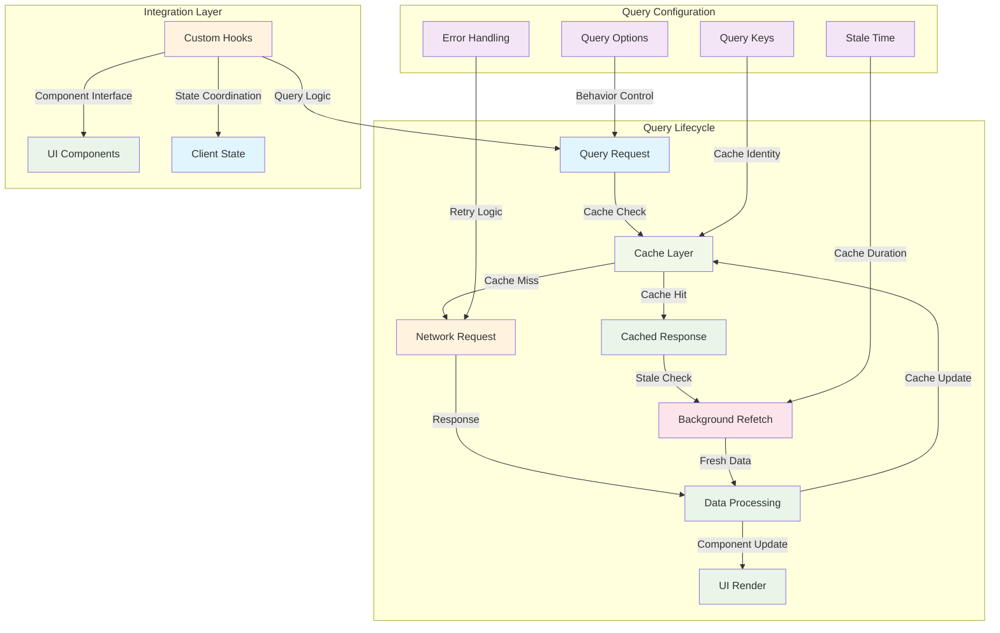
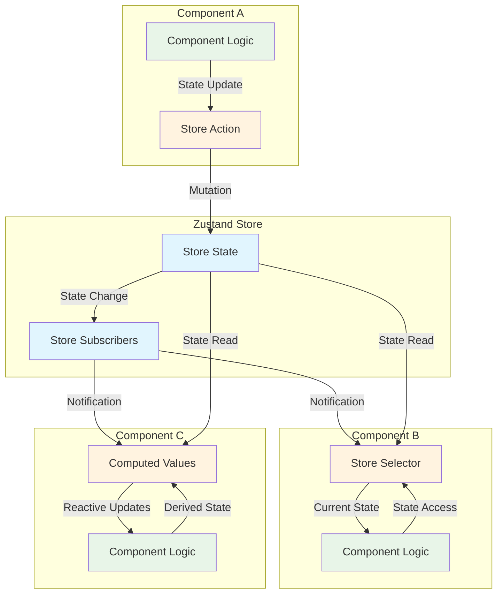

# State Management

This document outlines the state management architecture that coordinates application data flow, user interactions, and cross-component communication. The template uses a hybrid approach combining server state management for API responses with client state management for user preferences and application state.

## Related Documentation

- **[Architecture](./architecture.md)** - Coordinator pattern and architectural state integration
- **[Data Fetching](./data-fetching.md)** - Server state management with TanStack Query
- **[Caching](./caching.md)** - Cache coordination and state synchronization strategies
- **[Testing](./testing.md)** - State management testing patterns and store validation
- **[Authentication](./authentication.md)** - Authentication state patterns and security integration
- **[Examples](./examples.md)** - Practical state management implementation examples

---

## State Management Overview

### State Architecture Strategy

The template separates state concerns into distinct management layers, each optimized for specific data patterns and user experience requirements:

**State Architecture Flow:**

```
Server State (TanStack Query)
    ↓
API Responses & Caching
    ↓
Client State (Zustand)
    ↓
User Preferences & UI State
    ↓
Component Integration
    ↓
User Experience
```

### State Management Architecture

## State Management Architecture

### Server State (TanStack Query)

- **Purpose:** API responses, caching, background sync
- **Features:** Automatic caching, error handling, request deduplication
- **Integration:** Query cache ↔ Component updates ↔ External APIs

### Client State (Zustand)

- **Purpose:** User preferences, UI state, cross-component data
- **Features:** Local storage persistence, global state sharing
- **Integration:** Component state ↔ Browser storage ↔ State synchronization

### Integration Layer

- **Custom Hooks:** Unified interface between server and client state
- **User Interactions:** Trigger API mutations and state changes
- **Persistence:** Cross-session data recovery and synchronization

**Data Flow:** API ↔ TanStack Query ↔ Custom Hooks ↔ Components ↔ Zustand ↔ Local Storage

**State Management Distinction:**

- **Server State**: API responses, data fetching, and synchronization - managed by [TanStack Query](https://tanstack.com/query/latest)
- **Client State**: User preferences, UI state, and cross-component communication - managed by [Zustand](https://zustand-demo.pmnd.rs/)
- **Integration Layer**: Custom hooks provide unified interfaces combining both state types
- **Persistence**: Client state persists across sessions with selective storage strategies

### State Management Patterns Overview

| State Type          | Management Tool | Primary Use Cases                        | Key Features                                                       |
| ------------------- | --------------- | ---------------------------------------- | ------------------------------------------------------------------ |
| **Server State**    | TanStack Query  | API responses, data fetching, caching    | • Automatic caching<br>• Background sync<br>• Error handling       |
| **Client State**    | Zustand         | User preferences, UI state, app settings | • Persistence<br>• Cross-component sharing<br>• Simple mutations   |
| **Form State**      | React Hook Form | Form inputs, validation, submissions     | • Validation<br>• Performance optimization<br>• Error handling     |
| **Component State** | React useState  | Local component state, temporary data    | • Component-specific<br>• Ephemeral state<br>• Simple interactions |

### Detailed State Management Breakdown

**Server State Management** - API responses and data synchronization

**Architectural Decision:**
Server state requires specialized handling for caching, synchronization, and error recovery that differs fundamentally from application state management needs.

**Core Capabilities:**

- Automatic response caching with intelligent invalidation
- Background refetching and stale-while-revalidate patterns
- Request deduplication and concurrent query handling
- Error boundaries with retry mechanisms and fallback strategies

**Key Features:**

- Infinite query patterns for paginated data loading
- Configurable stale time and cache management
- Integration with GraphQL and REST adapters
- Optimistic updates with rollback capabilities

```typescript
// Server state example - Infinite entity loading
export const useMoreEntities = ({
  initialOffset = 8,
}: TUseMoreEntitiesOptions = {}) => {
  return useInfiniteQuery({
    queryKey: ENTITIES_QUERY_CONFIG.QUERY_KEY,
    queryFn: async ({ pageParam = initialOffset }) => {
      const response = await graphqlClient.query<IEntitiesResponse>(
        GET_ENTITIES_QUERY,
        {
          limit: ENTITIES_PER_PAGE,
          offset: pageParam,
        },
      )

      return {
        data: response.data?.entities?.results || [],
        nextOffset: pageParam + ENTITIES_PER_PAGE,
      }
    },
    staleTime: ENTITIES_QUERY_CONFIG.STALE_TIME,
    enabled: false,
  })
}
```

---

**Client State Management** - User preferences and application state

**Core Capabilities:**

- User preferences and application settings persistence
- Cross-component state sharing and communication
- UI state management for complex interactions
- Cross-session data persistence with selective storage

**Key Features:**

- [Zustand store architecture](https://zustand-demo.pmnd.rs/) with TypeScript integration
- Persistence middleware with selective state serialization
- Immutable update patterns with performance optimization
- Feature-based store organization for maintainability

```typescript
// Client state example - Entity viewing history
const useHistoryStore = create<IHistoryStore>()(
  persist(
    (set) => ({
      history: [],
      addToHistory: (entity: IEntity) => {
        return set((state) => {
          const existingIndex = state.history.findIndex(
            (item) => item.id === entity.id,
          )

          if (existingIndex !== -1) {
            // Move existing item to front
            const newHistory = [
              entity,
              ...state.history.filter((_, index) => index !== existingIndex),
            ]
            return {
              history: newHistory.slice(0, HISTORY_CONFIG.MAX_HISTORY_SIZE),
            }
          }

          // Add new item to front
          const newHistory = [entity, ...state.history]
          return {
            history: newHistory.slice(0, HISTORY_CONFIG.MAX_HISTORY_SIZE),
          }
        })
      },
      clearHistory: () => set({ history: [] }),
    }),
    {
      name: HISTORY_CONFIG.STORAGE_KEY,
      partialize: (state) => ({ history: state.history }),
    },
  ),
)
```

---

**Hybrid State Integration** - Coordinated state management

**Integration Strategy:**
Custom hooks coordinate server and client state to provide unified interfaces for component consumption, abstracting state management complexity from UI components.

**Implementation Pattern:**
Server state via TanStack Query for entity data, client state via Zustand for viewing history, seamless integration through custom hooks that handle both state types.

**Key Benefits:**

- Unified component interfaces abstracting state complexity
- Optimal performance characteristics for each state type
- Clear separation of concerns with coordinated updates
- Developer experience optimization through hook composition

---

## Store Architecture Patterns

### Zustand Store Organization

**Store Design Philosophy:**
Feature-based store organization with clear interfaces, immutable updates, and selective persistence strategies for performance and maintainability.

**Store Structure Pattern:**



**Store Design Characteristics:**

- **Feature-Based**: Stores organized by application domains and feature boundaries
- **Type-Safe**: Full TypeScript integration with interface definitions
- **Persistent**: Selective persistence with partialize strategies
- **Immutable**: State updates follow immutable patterns for predictable behavior

### Store Implementation Patterns

**Basic Store Structure**

The template uses a consistent pattern for store creation with clear separation between state properties and action methods:

```typescript
// Store interface definition
interface IHistoryStore {
  // State properties
  history: IEntity[]

  // Action methods
  addToHistory: (entity: IEntity) => void
  clearHistory: () => void
}

// Store implementation with persistence
const useHistoryStore = create<IHistoryStore>()(
  persist(
    (set) => ({
      // Initial state
      history: [],

      // State mutations
      addToHistory: (entity: IEntity) => {
        return set((state) => {
          // Immutable update logic with deduplication
        })
      },

      clearHistory: () => set({ history: [] }),
    }),
    {
      // Persistence configuration
      name: HISTORY_CONFIG.STORAGE_KEY,
      partialize: (state) => ({ history: state.history }),
    },
  ),
)
```

**Store Composition Strategy**

Multiple stores handle different application domains with clear boundaries and responsibilities:

**Implementation Pattern:**

- **Domain Separation**: Each store handles a specific feature domain
- **Interface Clarity**: Clear interfaces define state shape and available actions
- **Persistence Strategy**: Selective persistence based on data longevity requirements
- **Performance Optimization**: Minimal state updates with targeted subscriptions

**Store Organization:**

| Store Domain          | Responsibilities                         | Persistence Strategy          | Example Implementation                |
| --------------------- | ---------------------------------------- | ----------------------------- | ------------------------------------- |
| **Entity History**    | User viewing history tracking            | Local storage (cross-session) | `@/stores/entity-history`             |
| **User Preferences**  | Theme, language, notification settings   | Local storage (persistent)    | Feature-based preference stores       |
| **UI State**          | Modal states, navigation, temporary data | Session storage (temporary)   | Component-specific UI state stores    |
| **Application State** | Global app settings, feature flags       | Local storage (configurable)  | Application-wide configuration stores |

### State Update Patterns

**Immutable Update Implementation**

The template enforces immutable update patterns to ensure predictable state changes and optimal React rendering performance:

```typescript
// Complex state update with deduplication
addToHistory: (entity: IEntity) => {
  return set((state) => {
    const existingIndex = state.history.findIndex(
      (item) => item.id === entity.id,
    )

    if (existingIndex !== -1) {
      // Remove existing item and add to front
      const newHistory = [
        entity,
        ...state.history.filter((_, index) => index !== existingIndex),
      ]
      return {
        history: newHistory.slice(0, HISTORY_CONFIG.MAX_HISTORY_SIZE),
      }
    }

    // Add new item to front with size limit
    const newHistory = [entity, ...state.history]
    return {
      history: newHistory.slice(0, HISTORY_CONFIG.MAX_HISTORY_SIZE),
    }
  })
}
```

**Update Pattern Characteristics:**

- **Immutability**: All updates create new state objects rather than mutating existing state
- **Deduplication**: Smart handling of duplicate entries with position updates
- **Size Management**: Automatic trimming to maintain performance with large datasets
- **Atomic Updates**: Complete state transitions in single operations

---

## Server State Integration

### TanStack Query Architecture

**Query Management Philosophy:**
Server state requires specialized handling for caching, synchronization, error recovery, and performance optimization that differs from application state management.

**Query Strategy Implementation:**



### Query Implementation Patterns

**Basic Query Hook Structure**

The template uses consistent patterns for query hook creation with error handling, caching configuration, and component integration:

```typescript
// Search query with error handling
export const useEntityNameSearch = (searchTerm: string) => {
  const {
    data: result,
    isLoading,
    error,
    refetch,
  } = useQuery({
    queryKey: [ENTITY_SEARCH_QUERY_KEY, searchTerm],
    queryFn: () => searchEntityByName(searchTerm),
    enabled: !!searchTerm.trim(),
    staleTime: ENTITY_SEARCH_STALE_TIME,
    retry: 1,
  })

  return {
    result,
    isLoading,
    error: error as Error | null,
    refetch,
  }
}
```

**Infinite Query Implementation**

Complex pagination scenarios use infinite queries with background loading and cache management:

**Key Features:**

- Infinite scrolling with automatic page management
- Background data fetching with user-initiated triggers
- Cache coordination with page-based invalidation
- Error handling with partial data recovery

```typescript
// Infinite query for paginated entity data
export const useMoreEntities = ({
  initialOffset = 8,
}: TUseMoreEntitiesOptions = {}) => {
  return useInfiniteQuery({
    queryKey: ENTITIES_QUERY_CONFIG.QUERY_KEY,
    queryFn: async ({ pageParam = initialOffset }) => {
      const response = await graphqlClient.query<IEntitiesResponse>(
        GET_ENTITIES_QUERY,
        {
          limit: ENTITIES_PER_PAGE,
          offset: pageParam,
        },
      )

      return {
        data: response.data?.entities?.results || [],
        count: response.data?.entities?.count || 0,
        nextOffset: pageParam + ENTITIES_PER_PAGE,
      }
    },
    initialPageParam: initialOffset,
    getNextPageParam: (lastPage) => {
      const totalLoaded = lastPage.nextOffset
      return totalLoaded < lastPage.count ? lastPage.nextOffset : undefined
    },
    staleTime: ENTITIES_QUERY_CONFIG.STALE_TIME,
    enabled: false, // Manual trigger for performance
  })
}
```

### Cache Management Strategy

**Cache Configuration Patterns**

The template uses strategic cache configuration to balance performance with data freshness:

| Query Type         | Stale Time | Cache Strategy     | Use Case                                 |
| ------------------ | ---------- | ------------------ | ---------------------------------------- |
| **Static Data**    | 30 minutes | Long-term caching  | Entity metadata, unchanging data         |
| **Dynamic Data**   | 5 minutes  | Background refresh | Entity lists, frequently updated content |
| **Search Results** | 10 minutes | Moderate caching   | Search queries, user-driven requests     |
| **Real-time Data** | 30 seconds | Frequent refresh   | Live data, time-sensitive information    |

**Implementation Configuration:**

```typescript
// Cache configuration constants
export const ENTITIES_QUERY_CONFIG = {
  STALE_TIME: 5 * 60 * 1000, // 5 minutes
  QUERY_KEY: ['entities', 'infinite'],
}

export const ENTITY_SEARCH_STALE_TIME = 10 * 60 * 1000 // 10 minutes
```

---

## State Coordination Patterns

### Cross-Component Communication

**State Sharing Strategy:**
The template coordinates state across components through centralized stores and custom hooks, eliminating prop drilling while maintaining clear data flow patterns.

**Communication Architecture:**



### Hook Composition Strategy

**Custom Hook Integration**

The template uses custom hooks to coordinate multiple state sources and provide unified component interfaces:

```typescript
// Coordinated state hook example
export const useEntityInteraction = (entity: IEntity) => {
  // Server state for entity details
  const { data: entityDetails, isLoading, error } = useEntityDetails(entity.id)

  // Client state for viewing history
  const addToHistory = useHistoryStore((state) => state.addToHistory)
  const history = useHistoryStore((state) => state.history)

  // Coordinated actions
  const handleEntityView = useCallback(() => {
    addToHistory(entity)
    // Additional side effects
  }, [entity, addToHistory])

  // Derived state
  const isInHistory = useMemo(() => {
    return history.some((item) => item.id === entity.id)
  }, [history, entity.id])

  return {
    entityDetails,
    isLoading,
    error,
    isInHistory,
    handleEntityView,
  }
}
```

**Hook Composition Benefits:**

- **Unified Interface**: Components receive coordinated state through single hook
- **State Abstraction**: Complex state logic abstracted from component implementation
- **Performance Optimization**: Selective subscriptions and memoized computations
- **Testing Isolation**: Hook logic testable independently from UI components

---

## Performance Optimization

### Subscription Optimization

**Selective State Subscriptions**

The template minimizes component re-renders through targeted state subscriptions and memoized selectors:

```typescript
// Optimized selectors for specific data
const useEntityHistory = () => useHistoryStore((state) => state.history)
const useHistoryCount = () => useHistoryStore((state) => state.history.length)
const useHistoryActions = () =>
  useHistoryStore((state) => ({
    addToHistory: state.addToHistory,
    clearHistory: state.clearHistory,
  }))

// Component-specific optimized hooks
const useEntityInHistory = (entityId: string) => {
  return useHistoryStore((state) =>
    state.history.some((item) => item.id === entityId),
  )
}
```

## State Management Guidelines

### Implementation Best Practices

**Store Organization Guidelines:**

- **Feature Boundaries**: Organize stores by feature domains rather than data types
- **Interface Clarity**: Define clear interfaces separating state properties from actions
- **Persistence Strategy**: Use selective persistence based on data longevity requirements
- **Performance Optimization**: Implement targeted subscriptions and memoized computations

**Query Management Guidelines:**

- **Cache Configuration**: Configure appropriate stale times based on data freshness requirements
- **Error Handling**: Implement error boundaries with retry mechanisms
- **Loading States**: Coordinate loading states across multiple query sources
- **Query Keys**: Use consistent query key patterns for cache management

### Development Workflow

**State Development Process:**

1. **State Analysis**: Identify state type and appropriate management strategy
2. **Interface Design**: Define clear interfaces and action patterns
3. **Implementation**: Implement stores or queries with appropriate middleware
4. **Integration**: Create custom hooks for component coordination
5. **Testing**: Develop test coverage for state logic
6. **Optimization**: Profile and optimize subscription patterns and cache usage

---

## References

| Resource                                                                                      | Description                                             |
| --------------------------------------------------------------------------------------------- | ------------------------------------------------------- |
| [Zustand](https://zustand-demo.pmnd.rs/)                                                      | Small, fast, and scalable state management library      |
| [Zustand Persist Middleware](https://github.com/pmndrs/zustand#persist-middleware)            | Local storage integration for cross-session persistence |
| [TanStack Query](https://tanstack.com/query/latest)                                           | Data synchronization for React applications             |
| [TanStack Query React Guide](https://tanstack.com/query/latest/docs/framework/react/overview) | Complete React integration documentation                |
| [React useState Hook](https://react.dev/reference/react/useState)                             | Official React documentation for local state management |
| [React useContext Hook](https://react.dev/reference/react/useContext)                         | React Context API for component tree state sharing      |
