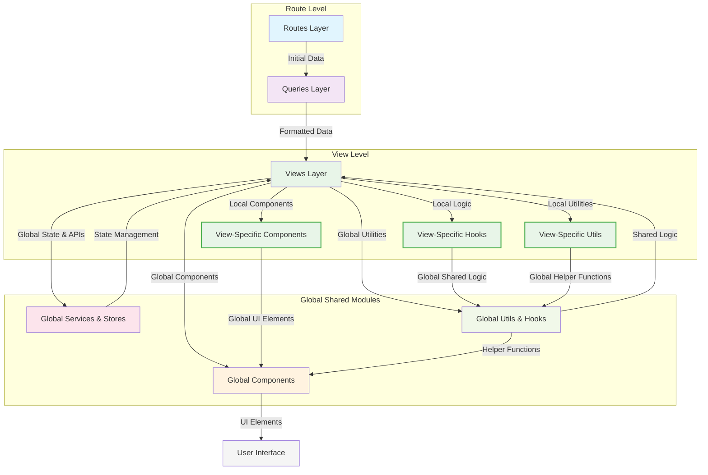
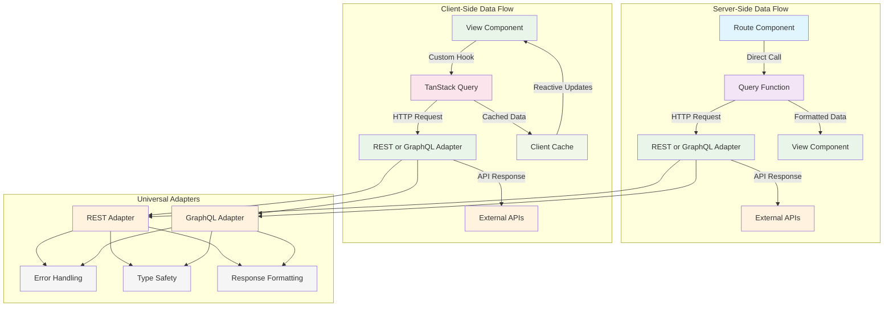
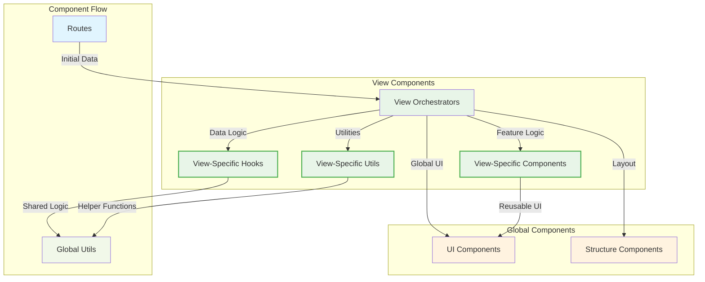
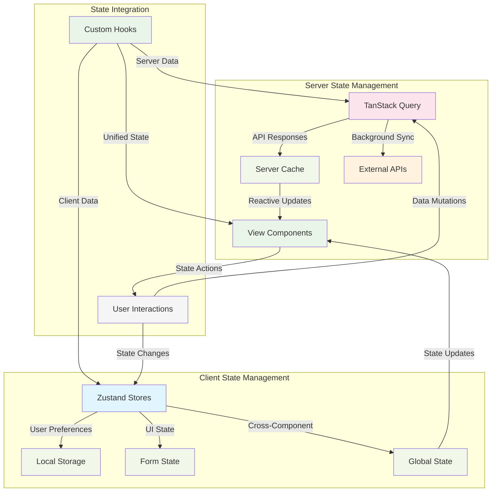
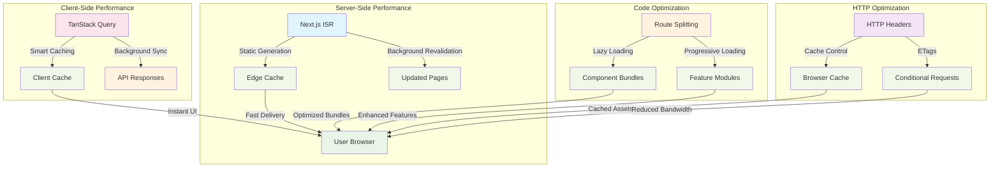

## Overview

This document outlines the architectural decisions, design patterns, and system organization that form the foundation of this Next.js template. The architecture prioritizes scalability, maintainability, and developer productivity through clear separation of concerns and established conventions.

**Live Implementation:** Pokemon Detail at `/pokemons/pikachu` demonstrates every architectural pattern described below.

---

## System Architecture

### Layered Architecture Model

The application follows a layered architecture pattern with clear separation of responsibilities:

**Architecture Flow:**

```
Routes (Server Components)
    ↓
Queries (Data Fetching)
    ↓
Views (Page Structure)
    ↓
Components (UI Elements)
    ↓
Services & Stores (Business Logic)
    ↓
Utils & Hooks (Shared Logic)
```

### Layer Responsibilities

#### Architecture Flow Overview



**Architecture Distinction:**

- **Global Modules** (blue backgrounds): Shared across the entire application - accessible via `@/` import paths
  - **Global Components**: `@/components` - Reusable UI components for the entire app
  - **Global Services & Stores**: `@/services` and `@/stores` - Application-wide state and API integrations
  - **Global Utils & Hooks**: `@/utils` and `@/hooks` - Shared utility functions and custom hooks
- **Module-Specific** (green borders): Local to individual view modules - contain feature-specific logic and components
  - **Example**: `app/views/pokemon-detail/components/`, `app/views/pokemon-detail/hooks/`, etc.
- **Bi-directional Flow**: Views can consume from both global and local modules, and local modules can leverage global utilities

#### Layer Responsibilities Overview

| Layer                 | Primary Responsibilities                          | Key Features                                                                           |
| --------------------- | ------------------------------------------------- | -------------------------------------------------------------------------------------- |
| **Routes**            | Server components, routing, initial data fetching | • Route-level error boundaries<br>• Loading states<br>• Next.js App Router integration |
| **Queries**           | Data fetching abstraction, API handling           | • API error handling<br>• Response formatting<br>• Cache configuration                 |
| **Views**             | Page orchestration, business logic coordination   | • Complete page structures<br>• State management<br>• User interaction handling        |
| **Components**        | Reusable UI building blocks                       | • Design system implementation<br>• Accessibility patterns<br>• Responsive design      |
| **Services & Stores** | Global business logic, API integrations           | • Application state management<br>• Cross-cutting concerns<br>• Data persistence       |
| **Utils & Hooks**     | Pure utilities, shared logic                      | • Data transformations<br>• Custom hooks<br>• Helper functions                         |

#### Detailed Layer Breakdown

**Routes Layer** - Server-side routing and initial data fetching

**Core Responsibilities:**

- Server components handling routing and initial data fetching
- Route-level error boundaries and loading states
- Direct integration with Next.js App Router

**Implementation Reference:** [`app/(routes)/(public)/(examples)/pokemons/[name]/page.tsx`](<../app/(routes)/(public)/(examples)/pokemons/[name]/page.tsx>)

**Key Patterns:**

- Server-first data fetching for SEO optimization
- Error boundary implementation at route level
- Loading state management during initial render

---

**Queries Layer** - Data fetching abstraction and API handling

**Core Responsibilities:**

- Data fetching abstraction co-located with routes
- API error handling and response formatting
- Cache configuration and revalidation strategies

**Implementation Reference:** [`app/(routes)/(public)/(examples)/pokemons/[name]/queries/get-pokemon-detail.query.ts`](<../app/(routes)/(public)/(examples)/pokemons/[name]/queries/get-pokemon-detail.query.ts>)

**Key Patterns:**

- Type-safe API response handling
- Next.js ISR configuration
- Unified error handling approach

---

**Views Layer** - Page orchestration and business logic coordination

**Core Responsibilities:**

- Complete page structures orchestrating multiple components
- Business logic coordination and state management
- User interaction handling and data presentation

**Implementation Reference:** [`app/views/pokemon-detail/pokemon-detail.tsx`](../app/views/pokemon-detail/pokemon-detail.tsx)

**Key Patterns:**

- Progressive enhancement without blocking render
- Component composition orchestration
- State management coordination

---

**Components Layer** - Reusable UI building blocks

**Core Responsibilities:**

- Reusable UI building blocks with focused responsibilities
- Design system implementation and consistency
- Accessibility and responsive design patterns

**Implementation Reference:** [`app/components/ui/`](../app/components/ui/) and [`app/views/pokemon-detail/components/`](../app/views/pokemon-detail/components/)

**Key Patterns:**

- Single responsibility principle
- Composition over inheritance
- Accessibility-first design

---

**Services & Stores Layer** - Global business logic and state management

**Core Responsibilities:**

- Global business logic and API integrations
- Application state management and persistence
- Cross-cutting concerns like authentication and logging

**Implementation Reference:** [`app/services/http/`](../app/services/http/) and [`app/stores/pokemon-history/`](../app/stores/pokemon-history/)

**Key Patterns:**

- Separation of server and client state
- Persistence strategies
- Cross-component communication

---

**Utils & Hooks Layer** - Pure utilities and shared logic

**Core Responsibilities:**

- Pure utility functions and data transformations
- Reusable custom hooks and shared logic
- Common patterns and helper functions

**Implementation Reference:** [`app/utils/`](../app/utils/) and [`app/hooks/`](../app/hooks/)

**Key Patterns:**

- Pure function implementation
- Hook composition patterns
- Utility function organization

---

## Data Fetching Architecture

### Data Flow Strategy Overview



**Data Strategy Distinction:**

- **Server-Side**: Initial data fetching for SEO and performance - can use either REST or GraphQL adapter with Next.js caching
- **Client-Side**: Dynamic data updates and user interactions - can use either REST or GraphQL adapter with TanStack Query
- **Universal Adapters**: Both REST and GraphQL adapters work in both server and client contexts
- **Flexible Choice**: Adapter selection based on data requirements, not rendering strategy
- **Example Implementation**: Pokemon Detail uses REST server-side and GraphQL client-side for demonstration only

### Data Fetching Patterns Overview

| Pattern               | Usage Context                          | Primary Benefits                                                       | Adapter Choice                 |
| --------------------- | -------------------------------------- | ---------------------------------------------------------------------- | ------------------------------ |
| **Server-Side Query** | Initial page loads, SEO-critical data  | • Fast initial render<br>• SEO optimization<br>• Next.js caching       | Either REST or GraphQL adapter |
| **Client-Side Hook**  | Dynamic updates, user interactions     | • Reactive caching<br>• Real-time updates<br>• Background sync         | Either REST or GraphQL adapter |
| **REST Adapter**      | Simple data fetching, reliable caching | • Simple implementation<br>• Reliable caching<br>• Type-safe responses | Works in both SSR and CSR      |
| **GraphQL Adapter**   | Complex queries, flexible data needs   | • Flexible queries<br>• Optimized requests<br>• Real-time capabilities | Works in both SSR and CSR      |

### Detailed Implementation Breakdown

**Universal Adapter Strategy** - Unified HTTP adapters for consistent API patterns

**Architectural Decision:**
Unified HTTP adapters supporting both server-side and client-side usage patterns with flexible transport implementations.

**Core Benefits:**

- Consistent API patterns across server and client contexts
- Flexible transport layer (fetch, axios, graphql-request)
- Unified error handling and response formatting
- Seamless integration with caching strategies

**Implementation Reference:** [`app/services/http/`](../app/services/http/)

---

**Server-Side Data Fetching** - Initial data loading for optimal performance

**Usage Pattern:**

- Route components call query functions directly
- Query functions can use either REST or GraphQL adapter for API communication
- Data is passed to view components as props
- Next.js handles caching and revalidation

**Implementation Reference:** [`app/(routes)/(public)/(examples)/pokemons/[name]/page.tsx`](<../app/(routes)/(public)/(examples)/pokemons/[name]/page.tsx>) (demonstrates REST adapter usage)

**Key Features:**

- Server component data fetching integration
- Query function integration with ISR
- Initial data passing to views
- SEO-optimized rendering
- Compatible with both REST and GraphQL adapters

---

**Client-Side Data Enhancement** - Dynamic updates and user interactions

**Usage Pattern:**

- View components use custom hooks for data management
- Custom hooks integrate with TanStack Query
- Either REST or GraphQL adapter can handle data requirements
- Cache management with stale-while-revalidate

**Implementation Reference:** [`app/views/pokemon-detail/pokemon-detail.hook.ts`](../app/views/pokemon-detail/pokemon-detail.hook.ts) (demonstrates GraphQL adapter usage)

**Key Features:**

- TanStack Query integration for reactive caching
- Flexible adapter usage within custom hooks
- Cache configuration and error handling
- Real-time data synchronization
- Compatible with both REST and GraphQL adapters

---

**REST Adapter Implementation** - Universal data fetching with comprehensive error handling

**Core Capabilities:**

- Fetch-based implementation with comprehensive error handling
- Automatic request/response transformation
- Configurable retry logic and timeout management
- Type-safe response validation with error boundaries

**Implementation Reference:** [`app/services/http/rest/`](../app/services/http/rest/)

**Usage Context:**

- Both server and client components
- Simple data fetching scenarios
- Reliable caching requirements
- Traditional REST API integrations

---

**GraphQL Adapter Implementation** - Universal data fetching with flexible queries

**Core Capabilities:**

- GraphQL-request integration with cache coordination
- Query optimization and request batching
- Schema-based type generation and validation
- Error handling with detailed GraphQL error formatting

**Implementation Reference:** [`app/services/http/graphql/`](../app/services/http/graphql/)

**Usage Context:**

- Both server and client components
- Complex data relationships and filtering
- Flexible query requirements
- Real-time updates and optimized requests

---

**Hybrid Data Strategy Example** - Pokemon Detail implementation

**Strategy Overview:**

- Initial data via REST adapter for server-side rendering (demonstration choice)
- Dynamic data via GraphQL adapter for client-side enhancement (demonstration choice)
- Unified error handling across both transport mechanisms
- Progressive enhancement without blocking initial render

**Implementation Reference:** [`app/views/pokemon-detail/`](../app/views/pokemon-detail/) module structure

**Data Flow:**

1. **Server-side**: Route fetches initial Pokemon data via REST (could use GraphQL)
2. **Client-side**: View enhances with moves data via GraphQL (could use REST)
3. **State management**: Unified error handling and loading states
4. **User experience**: Fast initial render with progressive enhancement

**Adapter Choice Rationale:**

- REST for server-side: Simple initial data structure
- GraphQL for client-side: Complex moves data with filtering
- Both choices are flexible and interchangeable based on requirements

---

## Component Architecture

### Component Hierarchy Overview



**Component Architecture Distinction:**

- **Global Components**: Shared across the entire application - design system and structure
- **View Components**: Page-level orchestrators that compose global and local components
- **View-Specific**: Local components, hooks, and utilities specific to individual features
- **Co-location Strategy**: Related functionality grouped within view modules for maintainability

### Component Types Overview

| Component Type         | Usage Context            | Key Characteristics                                                                         | Module Location                 |
| ---------------------- | ------------------------ | ------------------------------------------------------------------------------------------- | ------------------------------- |
| **Global UI**          | Design system components | • Reusable across features<br>• Consistent styling<br>• Accessibility patterns              | `@/components/ui/`              |
| **Global Structure**   | Layout and navigation    | • Application-wide layout<br>• Navigation patterns<br>• Shared structural components        | `@/components/structure/`       |
| **View Orchestrators** | Page-level components    | • Complete page implementations<br>• Business logic coordination<br>• Component composition | `@/views/[feature]/`            |
| **View-Specific**      | Feature-local components | • Single feature usage<br>• Complex feature logic<br>• Isolated development                 | `@/views/[feature]/components/` |

### Detailed Component Breakdown

**Global UI Components** - Design system building blocks

**Core Characteristics:**

- Design system building blocks (button, input, spinner)
- Consistent styling and behavior patterns
- Accessibility and responsive design implementation
- Reusable across multiple features

**Implementation Reference:** [`app/components/ui/`](../app/components/ui/)

**Usage Context:**

- Used across 3+ different modules
- Core infrastructure components
- Design system implementation
- Cross-feature consistency

---

**Global Structure Components** - Application layout and navigation

**Core Characteristics:**

- Application layout and navigation components
- Shared structural patterns for consistent UX
- Header, footer, and navigation components
- Layout orchestration and responsive design

**Implementation Reference:** [`app/components/structure/`](../app/components/structure/)

**Usage Context:**

- Application-wide layout components
- Navigation and routing integration
- Consistent user experience patterns
- Responsive design implementation

---

**View Orchestrators** - Complete page implementations

**Core Characteristics:**

- Complete page implementations with business logic
- Component composition and orchestration
- Route-specific functionality and data coordination
- Integration between server and client data

**Implementation Reference:** [`app/views/`](../app/views/)

**Example Implementation:** [`app/views/pokemon-detail/pokemon-detail.tsx`](../app/views/pokemon-detail/pokemon-detail.tsx)

**Key Features:**

- Orchestrates multiple data sources (server + client)
- Integrates state management for cross-session features
- Composes sub-components for complex UI interactions
- Handles progressive enhancement patterns

---

**View-Specific Components** - Feature-local components

**Core Characteristics:**

- Components used exclusively within specific views
- Complex view-internal logic and interactions
- Not intended for reuse outside the parent view
- Isolated development and testing

**Implementation Reference:** [`app/views/[view]/components/`](../app/views/pokemon-detail/components/)

**Example Implementation:** [`app/views/pokemon-detail/components/pokemon-moves/`](../app/views/pokemon-detail/components/pokemon-moves/)

**Key Features:**

- GraphQL integration for dynamic moves data
- View-specific business logic and formatting
- Isolated testing and development
- Feature-specific optimization

---

**Module Co-location Strategy** - Organized development approach

**Decision Rationale:**
Co-locate related functionality for development efficiency and maintainability.

**Implementation Pattern:**
View modules contain hooks, types, components, tests

**Reference Implementation:** [`app/views/pokemon-detail/`](../app/views/pokemon-detail/) directory structure

**Key Benefits:**

- Related functionality grouped in feature modules
- Clear boundaries between global and module-specific code
- Testing co-located with implementation for development efficiency
- Reduced cognitive load during development

**Boundary Definition:**

- **Global**: Used across 3+ different modules or core infrastructure
- **Module-specific**: Used exclusively within single feature context
- **View-specific**: Used only within individual view implementation

**Classification Examples:**

- [`components/ui/button.tsx`](../app/components/ui/button.tsx) → Global (used across multiple features)
- [`views/pokemon-detail/pokemon-detail.hook.ts`](../app/views/pokemon-detail/pokemon-detail.hook.ts) → Module-specific (only used in Pokemon Detail)
- [`services/http/rest-client.ts`](../app/services/http/rest/) → Global (used by multiple route queries)

---

## State Management Architecture

### State Strategy Overview



**State Strategy Distinction:**

- **Server State**: API responses, caching, and synchronization - managed by TanStack Query
- **Client State**: User preferences, UI state, and cross-component communication - managed by Zustand
- **Hybrid Integration**: Custom hooks coordinate both state types for seamless user experience
- **Reactive Updates**: State changes trigger component updates through established patterns

### State Management Patterns Overview

| State Type          | Management Tool | Primary Use Cases            | Key Features                                                         |
| ------------------- | --------------- | ---------------------------- | -------------------------------------------------------------------- |
| **Server State**    | TanStack Query  | API responses, data fetching | • Automatic caching<br>• Background sync<br>• Error handling         |
| **Client State**    | Zustand         | User preferences, UI state   | • Persistence<br>• Cross-component sharing<br>• Simple mutations     |
| **Form State**      | React Hook Form | Form inputs, validation      | • Validation<br>• Performance optimization<br>• Integration patterns |
| **Component State** | React useState  | Local component state        | • Component-specific<br>• Temporary state<br>• Simple interactions   |

### Detailed State Management Breakdown

**Server State Management** - API responses and data synchronization

**Decision Rationale:**
Different types of state require different management approaches for optimal performance and developer experience.

**Core Capabilities:**

- API response caching and synchronization
- Background refetching and optimistic updates
- Error handling and retry mechanisms
- Request deduplication and cache invalidation

**Implementation Reference:** [`app/views/pokemon-detail/pokemon-detail.hook.ts`](../app/views/pokemon-detail/pokemon-detail.hook.ts)

**Key Features:**

- TanStack Query configuration and cache management
- Error handling and loading state coordination
- GraphQL data fetching with intelligent caching
- Error boundary integration and retry logic

---

**Client State Management** - User preferences and application state

**Core Capabilities:**

- User preferences and application settings
- Form state and UI interactions
- Cross-component communication
- Persistence and hydration management

**Implementation Reference:** [`app/stores/pokemon-history/`](../app/stores/pokemon-history/)

**Key Features:**

- Feature-based store segmentation
- Clear interfaces and type definitions
- Persistence strategies for cross-session data
- Viewing history with local storage persistence

---

**Hybrid State Integration** - Coordinated state management

**Integration Pattern:**
Server state via TanStack Query for Pokemon data, client state via Zustand for viewing history, seamless integration between both state types.

**Implementation Reference:** [`app/views/pokemon-detail/`](../app/views/pokemon-detail/) module integration

**Key Benefits:**

- Unified state management approach
- Clear separation of concerns
- Optimal performance for each state type
- Developer experience optimization

---

**State Architecture Patterns** - Implementation strategies

**Store Organization Pattern:**

- Feature-based store segmentation
- Clear interfaces and type definitions
- Persistence strategies for cross-session data
- Type-safe state mutations and subscriptions
- Integration with component lifecycle

**Implementation Reference:** [`app/stores/pokemon-history/`](../app/stores/pokemon-history/)

**Hook Integration Pattern:**

- Custom hooks encapsulating state logic
- TanStack Query configuration and cache management
- Error handling and loading state coordination
- Optimistic updates and cache invalidation

**Implementation Reference:** [`app/views/pokemon-detail/pokemon-detail.hook.ts`](../app/views/pokemon-detail/pokemon-detail.hook.ts)

**State Flow Coordination:**

1. **Server State**: TanStack Query manages API responses and caching
2. **Client State**: Zustand handles user preferences and UI state
3. **Integration**: Custom hooks coordinate both state types
4. **Updates**: Reactive updates trigger component re-renders
5. **Persistence**: Client state persists across sessions

---

## Performance Architecture Implementation

### Performance Strategy Overview



**Performance Strategy Distinction:**

- **Server-Side**: Next.js ISR with edge caching for fast initial loads
- **Client-Side**: TanStack Query with intelligent caching for reactive updates
- **Code Optimization**: Route and component splitting for optimized bundle sizes
- **HTTP Optimization**: Cache headers and ETags for efficient network usage

### Performance Optimization Patterns Overview

| Strategy              | Implementation            | Primary Benefits                     | Key Features                                                                     |
| --------------------- | ------------------------- | ------------------------------------ | -------------------------------------------------------------------------------- |
| **Server-Side Cache** | Next.js ISR               | Fast initial loads, SEO optimization | • Static generation<br>• Background revalidation<br>• Edge caching               |
| **Client-Side Cache** | TanStack Query            | Reactive updates, offline support    | • Smart invalidation<br>• Background sync<br>• Request deduplication             |
| **Code Splitting**    | Next.js + Dynamic Imports | Reduced bundle sizes, faster loads   | • Route-based splitting<br>• Component lazy loading<br>• Progressive enhancement |
| **HTTP Optimization** | Cache Headers + ETags     | Reduced bandwidth, faster responses  | • Cache control<br>• Conditional requests<br>• Static asset optimization         |

### Detailed Performance Breakdown

**Multi-Layer Caching Strategy** - Comprehensive caching approach

**Next.js Cache (Server-Side)**

- Route-level ISR with configurable revalidation
- Automatic static generation for popular pages
- Edge caching integration for global performance
- ISR revalidation configuration at 3600 seconds
- Error state handling with cache invalidation

**Implementation Reference:** [`app/(routes)/(public)/(examples)/pokemons/[name]/queries/get-pokemon-detail.query.ts`](<../app/(routes)/(public)/(examples)/pokemons/[name]/queries/get-pokemon-detail.query.ts>)

**TanStack Query Cache (Client-Side)**

- Smart invalidation and background refetching
- Stale-while-revalidate patterns for optimal UX
- Query deduplication and request batching
- Cache configuration with staleTime and gcTime
- Smart retry logic with exponential backoff

**Implementation Reference:** [`app/views/pokemon-detail/pokemon-detail.hook.ts`](../app/views/pokemon-detail/pokemon-detail.hook.ts)

**Browser Cache (HTTP Headers)**

- Appropriate cache headers for static assets
- API response caching with ETags
- Service worker integration preparation

**Implementation Reference:** [`app/services/http/`](../app/services/http/) adapter implementations

---

**Code Splitting Strategy** - Optimized bundle delivery

**Route-Based Splitting**

- Automatic code splitting via Next.js App Router
- Lazy loading for non-critical routes
- Optimized bundle sizes for faster initial loads

**Implementation Reference:** Next.js App Router structure in [`app/(routes)/`](<../app/(routes)/>)

**Component-Based Splitting**

- Dynamic imports for heavy components
- Conditional loading based on user interactions
- Progressive enhancement patterns

**Implementation Reference:** [`app/views/pokemon-detail/components/`](../app/views/pokemon-detail/components/) structure

**Progressive Loading Implementation**

- Initial page load with essential data
- Progressive enhancement with additional features
- Optimized bundle splitting for performance

**Example Reference:** Pokemon Detail progressive loading implementation

---

**Performance Monitoring Strategy** - Continuous optimization

**Core Metrics Tracking:**

- First Contentful Paint (FCP) optimization
- Largest Contentful Paint (LCP) monitoring
- Cumulative Layout Shift (CLS) prevention
- First Input Delay (FID) minimization

**Implementation Approach:**

- Performance budget enforcement
- Bundle size monitoring and alerts
- Runtime performance tracking
- User experience metrics collection

**Cache Efficiency Monitoring:**

- Cache hit rates and optimization
- API response time tracking
- Client-side cache effectiveness
- Server-side cache utilization
